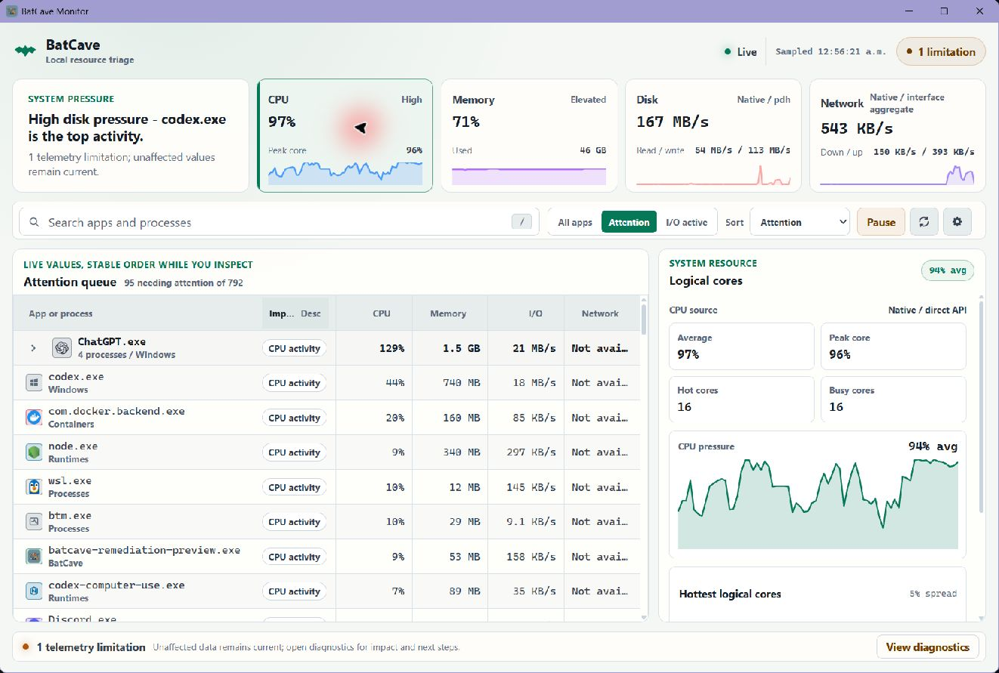
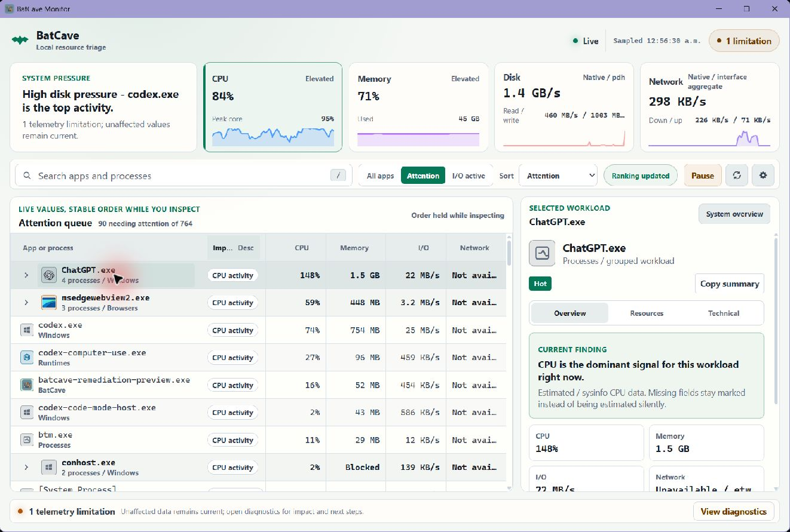
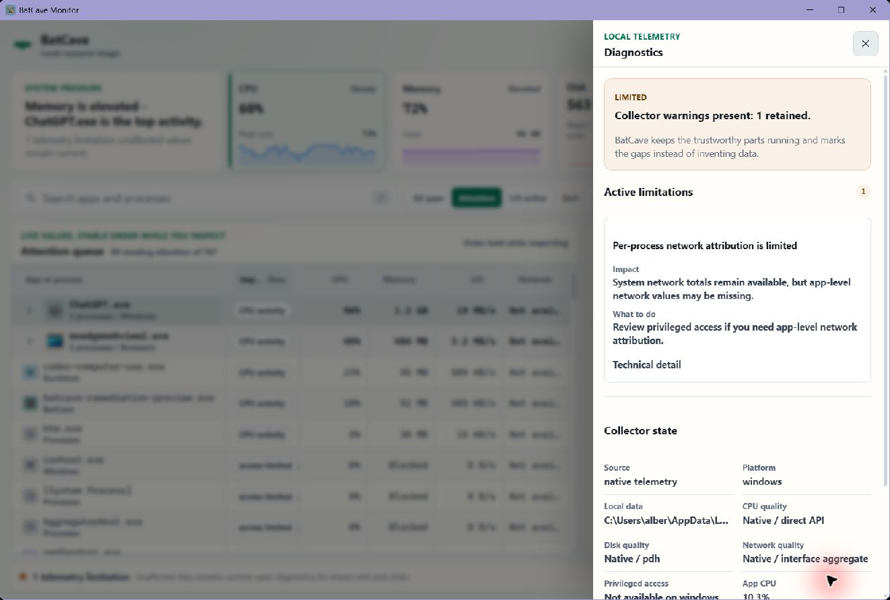
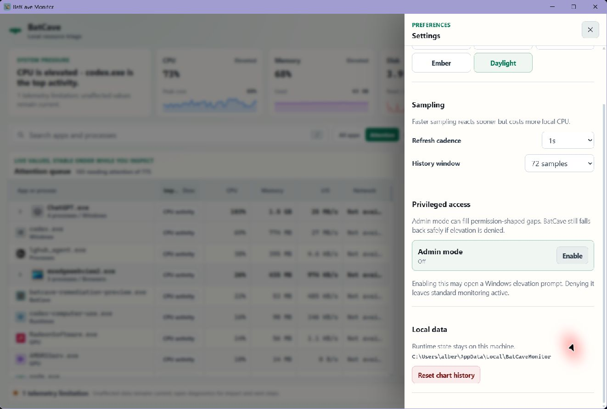
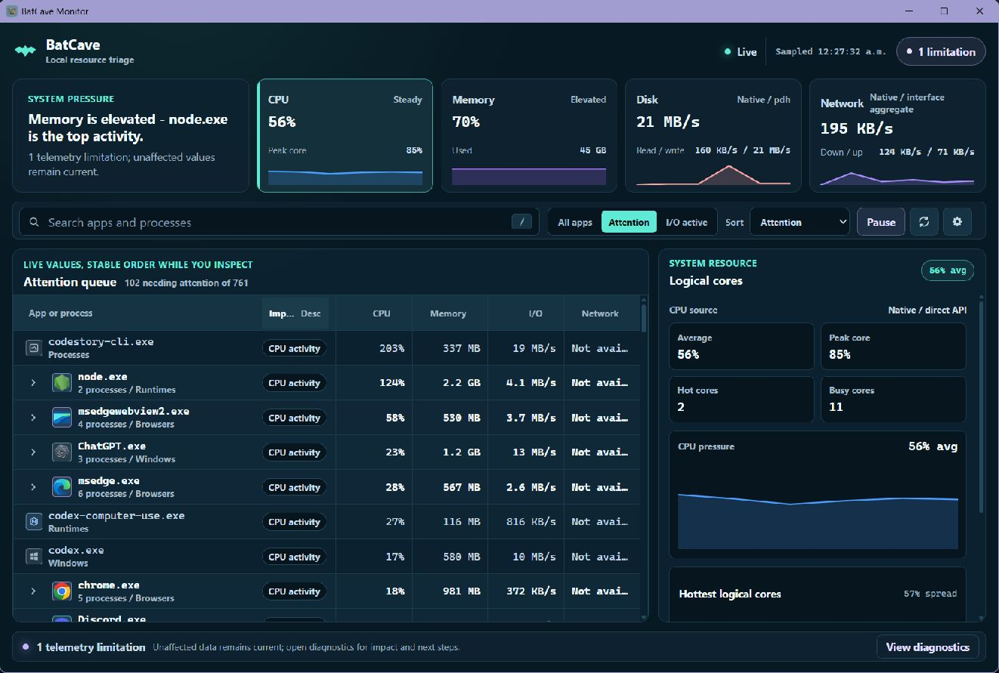
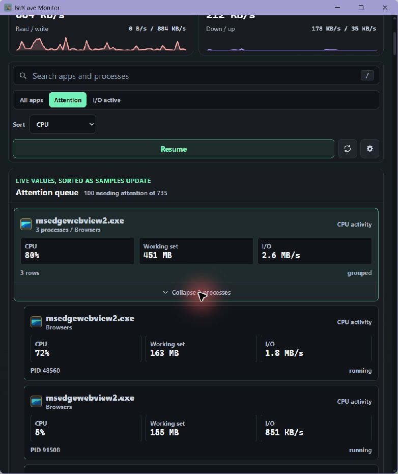
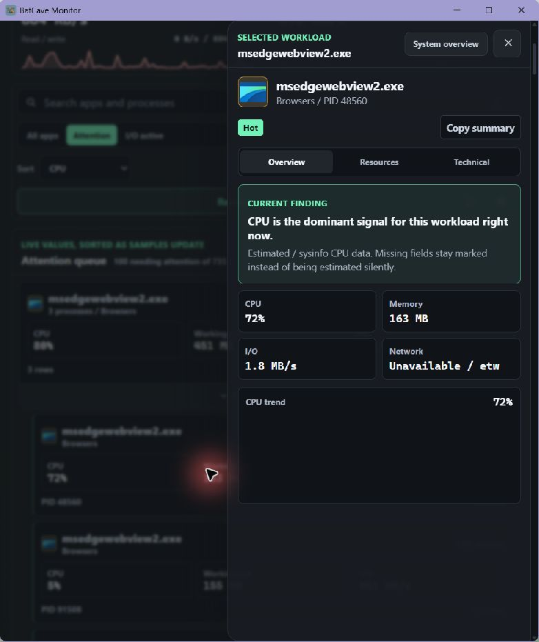

# BatCave Monitor

BatCave Monitor is a local-first resource cockpit for Windows, Linux, and macOS. It shows the machine underneath the machine: machine-total CPU, memory, disk and network movement, process triage, runtime health, and the little permission-shaped holes where the operating system says "not today."

This is a public preview. It is useful now, honest about what it cannot see, and intentionally boring about privacy: BatCave reads local telemetry and keeps it local.

### Light Theme









### Dark Theme







Screenshots show the native Tauri app with live Windows telemetry. Browser fixture screenshots are layout-only and should not be used as product proof.

## What It Shows

- A selected-resource summary that keeps the headline, value, chart, time window, source quality, and compatible process attribution on one semantic.
- A stable grouped workload ranking that keeps row identity and scroll position fixed while the user inspects live values.
- A contextual detail pane with Overview, Resources, and Technical views for the selected workload or system resource.
- Plain-language telemetry diagnostics that explain impact, next steps, and raw collector detail on demand.
- Focused drawers for appearance, sampling, privileged access, and local data controls.
- A compact card layout at narrow window widths, with the same diagnosis path as the desktop table.

BatCave does not pretend. If ETW, eBPF, `/proc`, `/sys`, libproc, PDH, or process permissions are unavailable, the app keeps running and marks the affected metric honestly instead of painting fake numbers over the crack.

## Preview Status

BatCave is ready for source-based testing and local preview builds.

- Windows, Linux, and macOS native telemetry collectors are implemented.
- The Tauri app can run as a native desktop shell or as a browser-only fixture UI for layout testing.
- Windows bundles currently produce an unsigned executable and NSIS installer.
- Linux builds produce `.deb` and AppImage bundles.
- macOS builds produce one universal Apple Silicon/Intel DMG with a macOS 12 minimum.
- The signed updater is implemented; Windows Authenticode release promotion remains gated on SignPath approval.

## Release Platform Support

The canonical human-readable profile matrix is [Platform capabilities](docs/platform-capabilities.md), and the machine authority is the [version 1 platform support contract](docs/evidence/releases/platform-support-contract.v1.json). The declared release profiles are Windows 10 client `10.0.16299`+ on `x86_64` with NSIS; Ubuntu `22.04`+ and Debian `12`+ on `x86_64` glibc with deb and AppImage packages; and macOS `12.0`+ on universal `arm64` + `x86_64` with a DMG and updater archive. Every profile is `source_enforced`; `native_oldest_supported` remains `pending`. Hosted builds, metadata checks, and package inspection do not prove installation or runtime behavior on an oldest-supported host.

## Try It

Install prerequisites first:

- Node.js 24
- A current stable Rust toolchain
- On Windows, Microsoft Edge WebView2 Evergreen Runtime. The NSIS bundle embeds Microsoft's Evergreen Standalone Installer, so installation works without network access when WebView2 is missing.
- On Linux, the WebKitGTK/GTK/Tauri native packages installed by `scripts/install-linux-deps.sh`
- On macOS, Xcode Command Line Tools. Universal bundles also require `rustup target add aarch64-apple-darwin x86_64-apple-darwin`.

From the repository root on Windows:

```powershell
cd src\BatCave.App
npm install
cd ..\..
powershell -NoProfile -ExecutionPolicy Bypass -File scripts/run-dev.ps1
```

Run only the browser UI with deterministic fixture telemetry:

```powershell
powershell -NoProfile -ExecutionPolicy Bypass -File scripts/run-dev.ps1 -WebOnly
```

From the repository root on Ubuntu 22.04, Debian 12, or newer releases within those declared profiles:

```bash
bash scripts/install-linux-deps.sh
cd src/BatCave.App
npm install
cd ../..
bash scripts/run-dev.sh
```

Run the Linux browser-only fixture UI:

```bash
bash scripts/run-dev.sh --web-only
```

On macOS, the shared shell launcher detects Darwin and starts the native Mac build:

```bash
cd src/BatCave.App
npm install
cd ../..
bash scripts/run-dev.sh
```

Use `bash scripts/run-dev.sh --web-only` only for deterministic layout work.

## Validate And Build

Run the full Windows validation workflow:

```powershell
powershell -NoProfile -ExecutionPolicy Bypass -File scripts/validate-tauri.ps1
```

Run the Linux or macOS equivalent (Darwin builds the universal DMG unless `--skip-bundle` is supplied):

```bash
bash scripts/validate-tauri.sh
```

For faster app-level checks from `src/BatCave.App`:

```powershell
npm run verify
npm run tauri -- dev
npm run tauri -- build
```

On Linux, use:

```bash
npm run verify
npm run tauri -- dev
npm run tauri -- build
```

On macOS, use:

```bash
npm run verify
npm run tauri -- dev
npm run tauri -- build --target universal-apple-darwin
```

Windows release builds emit the release executable and unsigned, offline-capable NSIS installer under `src/BatCave.App/src-tauri/target/release`. The installer embeds Microsoft's WebView2 Evergreen Standalone Installer. This adds roughly 127 MB to the artifact, avoids install-time network access, and leaves runtime security servicing with the Evergreen updater rather than pinning a fixed WebView2 version. BatCave does not publish a separate online-bootstrapper variant. Building the bundle can still download the Microsoft redistributable into Tauri's build cache; shipping and installation do not require that build-time connection. Distribution remains subject to the [Microsoft Edge WebView2 Runtime license](https://www.microsoft.com/software-download/webview2). Linux builds emit `.deb` and AppImage bundles under `src/BatCave.App/src-tauri/target/release/bundle`. Universal macOS output lands under `src/BatCave.App/src-tauri/target/universal-apple-darwin/release/bundle`, including the `.app`, DMG, and release-only updater archive.

## Privacy And Local Data

BatCave is local-only by design. Do not add outbound tracking, remote logging, hosted collection, or surprise network dependencies.

Runtime state, settings, warm cache, and logs stay under:

- Windows: `%LOCALAPPDATA%\BatCaveMonitor`
- Linux: `$XDG_DATA_HOME/BatCaveMonitor` or `~/.local/share/BatCaveMonitor`
- macOS: `~/Library/Application Support/BatCaveMonitor`

Theme preference is stored in browser `localStorage` under `batcave.monitor.theme`.

The [current-user state ownership and retention contract](docs/current-user-state.md) defines the owned files, permission checks, diagnostic limits, and safe cleanup boundary.

## Platform Notes

- Windows per-process network attribution uses ETW over the kernel TCP/IP provider. If the kernel logger cannot start or access is denied, BatCave reports the reason and continues.
- The Windows app starts with the invoking user's token and stays `asInvoker`. An installed collector service supplies protected telemetry; missing, stopped, incompatible, or unauthorized service states fall back visibly to standard-access collection without launch-time elevation. A copied release executable is reported as portable, development builds as development, and an NSIS install only when the executable directory matches Tauri's uninstall-registry location. Failed executable or registry probes are reported as unavailable instead of portable. The UI reports the Windows token state as unavailable when it cannot be read.
- Linux aggregate telemetry uses `/proc` and `/sys`. Optional per-process network attribution uses owned `bpftrace`/eBPF probes when the host has the needed permissions or capabilities. It counts IPv4/IPv6 sockets only, excludes Unix-domain traffic, and marks a failed or missing collector unavailable rather than reporting zero. Install that optional tool with `bash scripts/install-linux-deps.sh --with-bpftrace`; the default dependency install does not require it.
- macOS telemetry uses sysinfo plus local libproc process details and deduplicated IOKit physical block-driver counters. Disk images are excluded from host disk, host network includes loopback, and per-process network attribution and privileged collection are intentionally unavailable.
- Browser fixture mode is for UI work. It is deterministic on purpose and is not proof of native collector behavior.

## Benchmarks

Run a headless runtime benchmark:

```powershell
powershell -NoProfile -ExecutionPolicy Bypass -File scripts/run-benchmark.ps1 -BenchmarkHost core -Platform x64 -Ticks 120 -SleepMs 1000
```

Capture a reusable benchmark baseline artifact:

```powershell
powershell -NoProfile -ExecutionPolicy Bypass -File scripts/capture-benchmark-baseline.ps1 -BenchmarkHost core -Platform x64
```

Run the strict regression gate with either a matching baseline artifact or an explicit p95 budget. The normal validation scripts keep their fast smoke check; this gate is for release/local performance validation and writes a report under `artifacts/benchmarks`.

```powershell
powershell -NoProfile -ExecutionPolicy Bypass -File scripts/run-benchmark-gate.ps1 -BenchmarkHost core -Platform x64 -BaselineArtifactPath artifacts\benchmarks\baseline-core-YYYYMMDD-HHMMSS.json
powershell -NoProfile -ExecutionPolicy Bypass -File scripts/run-benchmark-gate.ps1 -BenchmarkHost core -Platform x64 -MaxP95Ms 10000
powershell -NoProfile -ExecutionPolicy Bypass -File scripts/validate-tauri.ps1 -SkipBundle -BenchmarkGate -BenchmarkMaxP95Ms 10000
```

Linux and macOS equivalents are available at `scripts/run-benchmark.sh`, `scripts/capture-benchmark-baseline.sh`, and `scripts/run-benchmark-gate.sh`; the shared scripts detect the host and normalize Apple `arm64` to the public `aarch64` contract.

Benchmark artifact format v4 measures the owned sampling engine's `refresh_now` command and protocol-v3 encoding/JSON serialization as separate phases in an isolated temporary data directory. Collection includes transform, sorting, and persistence; publication covers the immutable snapshot build and swap. It reports median collection, publication, serialization, and live-command p95 values; latency ceilings and baseline speed ratios gate `median_live_command_p95_ms`. Output carries `evidence_scope: core_runtime_host_only` and `whole_app_measured: false`, so it is not whole-app or process-tree evidence. The CLI flag remains `-SleepMs`/`--sleep-ms`, while the schema records it as `inter_command_delay_ms`. Samples must advance exactly once per measured command. Baseline artifacts include the commit, release-binary hash, machine class, workload, every repeat, and the component medians.

The complete-remediation release comparison is preserved in [docs/evidence/benchmarks/remediation-20260710.json](docs/evidence/benchmarks/remediation-20260710.json), including source hashes, commit provenance, protocol settings, all repeats, and the strict gate result.

## Continuous Integration

Pull requests and `codex/**` pushes run Windows, Linux, and dual-architecture macOS validation without packaging. Pull requests also reject newly introduced dependencies with moderate-or-higher advisories. Pushes to `main` and manual bundle runs produce Windows NSIS, Linux deb/AppImage, and ad-hoc-signed universal Mac artifacts retained for 14 days. The versioned release workflow produces 30-day dry-run artifacts or durable GitHub Releases with aligned versions, checksums, build provenance, and a Developer ID-signed/notarized/stapled Mac DMG. A separate Monday/manual audit runs `npm audit --omit=dev` and pinned `cargo-audit 0.22.2`.

## More Documentation

- [App runbook](src/BatCave.App/README.md) covers native/browser run modes, app scripts, and platform troubleshooting.
- [Runtime telemetry](docs/runtime-telemetry.md) covers the Rust runtime store, native collectors, quality states, collector-service behavior, and benchmark surfaces.
- [Platform capabilities](docs/platform-capabilities.md) is the canonical telemetry, scope, privilege, package, and CPU-architecture matrix.
- [Release channels and verification](docs/releases.md) covers version alignment, stable/prerelease policy, checksums, provenance, and publication.

## Contributing

Keep the app local, explicit, and boringly reliable. Match the existing Rust/Tauri/Svelte boundaries, preserve the snake_case JSON contracts, and run the narrowest meaningful verification before opening a PR.
