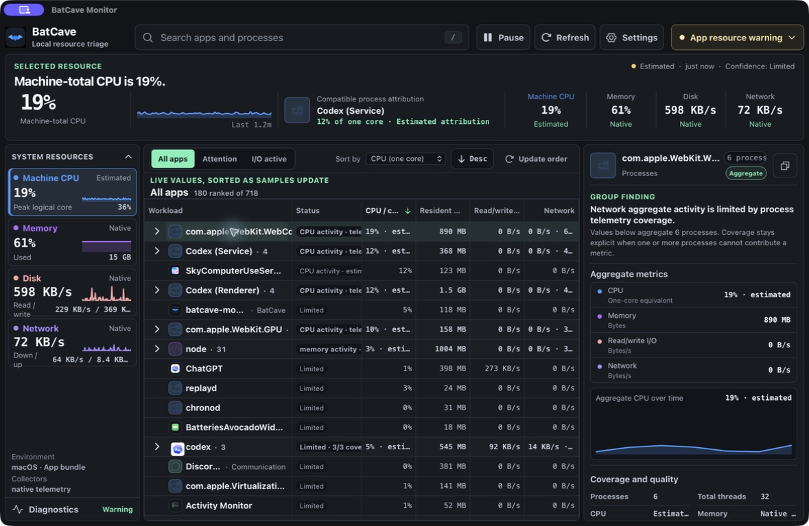
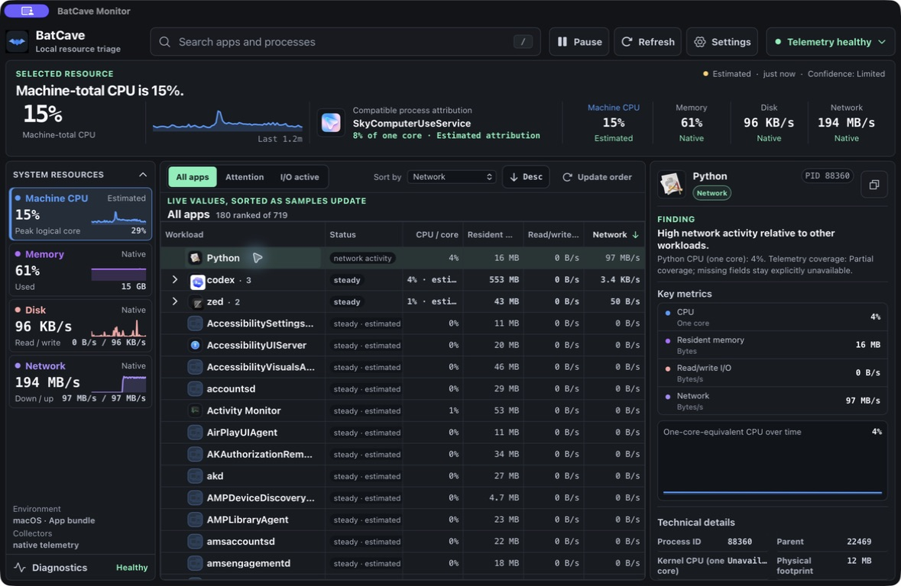

<p align="center">
  
</p>

<h1 align="center">BatCave Monitor</h1>

<p align="center">
  Local resource triage for Windows, Linux, and Apple Silicon Macs.
</p>

BatCave shows what is putting pressure on your machine, which workloads are responsible, and how trustworthy each number is. It combines machine-wide CPU, memory, disk, and network telemetry with a stable process ranking and a focused workload inspector.



<p align="center"><sub>Native Apple Silicon app with live local telemetry. No browser fixtures.</sub></p>

## Find the problem, then inspect it

- See machine pressure and the best matching workload in one glance.
- Rank grouped apps and individual processes by CPU, memory, disk, or network activity.
- Keep workload order stable while live values update, or refresh the ranking when you choose.
- Open a process or group to inspect trends, totals, source quality, coverage, and technical details.
- Filter to workloads that need attention or are actively moving data.
- Read `Native`, `Estimated`, `Limited`, and `Unavailable` as real collection states—not decorative labels.

If the operating system denies a process, a collector is still warming up, or a source cannot support a metric, BatCave says so. It does not turn missing telemetry into zeroes.

## Per-process network activity

Network is a first-class column. BatCave attributes live TCP, UDP, and QUIC traffic to processes on macOS, IP socket payloads through ETW on Windows, and optional eBPF probes on Linux.



<p align="center"><sub>A local transfer captured through macOS NStat and attributed to its owning process.</sub></p>

## Platform support

| Platform | Release target | Machine telemetry | Per-process network | Package |
| --- | --- | --- | --- | --- |
| Windows | Windows 10 `10.0.16299`+, x86-64 | Win32 and PDH | ETW; installed service for protected collection | NSIS |
| Linux | Ubuntu 22.04+ or Debian 12+, x86-64 glibc | `/proc` and `/sys` | Optional bpftrace/eBPF | deb, AppImage |
| macOS | macOS 12+, Apple Silicon | sysinfo, libproc, IOKit | XNU NStat | DMG |

Intel Macs, Windows ARM64, Linux ARM64, musl, and unlisted operating-system profiles are not supported release targets. The complete source, scope, failure, and proof contract lives in [Platform capabilities](docs/platform-capabilities.md).

## Get BatCave

BatCave is currently a public preview. Download a packaged build from [GitHub Releases](https://github.com/TheGreenCedar/BatCave/releases), or run it from source.

You will need Node.js 24 and a current stable Rust toolchain. Linux also needs the native Tauri dependencies installed by `scripts/install-linux-deps.sh`. macOS development requires Apple Silicon, Xcode Command Line Tools, and the `aarch64-apple-darwin` Rust target.

### macOS or Linux

```bash
# Linux only
bash scripts/install-linux-deps.sh

cd src/BatCave.App
npm install
cd ../..
bash scripts/run-dev.sh
```

On macOS, add the target once with `rustup target add aarch64-apple-darwin`. To enable optional Linux process-network attribution, install the extra probe with `bash scripts/install-linux-deps.sh --with-bpftrace`.

### Windows

```powershell
cd src\BatCave.App
npm install
cd ..\..
powershell -NoProfile -ExecutionPolicy Bypass -File scripts/run-dev.ps1
```

The Windows installer includes the WebView2 Evergreen runtime for offline installation. Public Windows artifacts remain unsigned while the Authenticode release gate is unresolved.

## Build and verify

Run the platform validation workflow from the repository root:

```bash
# macOS or Linux
bash scripts/validate-tauri.sh
```

```powershell
# Windows
powershell -NoProfile -ExecutionPolicy Bypass -File scripts/validate-tauri.ps1
```

These workflows cover the frontend checks, Rust formatting and tests, and the native bundle. macOS produces an Apple Silicon build only.

For deterministic layout work, use `bash scripts/run-dev.sh --web-only` or the Windows `-WebOnly` switch. Browser fixture mode does not exercise native collectors and is never acceptable as telemetry proof.

## Local by design

BatCave reads resource telemetry on your machine and keeps its settings, cache, and logs there. It has no analytics, telemetry upload, remote logging, or background update check. The manual **Check now** action is the only product-owned release lookup.

Local state lives under:

- Windows: `%LOCALAPPDATA%\BatCaveMonitor`
- Linux: `$XDG_DATA_HOME/BatCaveMonitor` or `~/.local/share/BatCaveMonitor`
- macOS: `~/Library/Application Support/BatCaveMonitor`

See [Current-user state](docs/current-user-state.md) for ownership, retention, permissions, and cleanup behavior.

## Project status

The native collectors, runtime store, desktop UI, packaging, updater, and cross-platform validation lanes are implemented. The support contract distinguishes source-enforced targets from native proof on the oldest supported hosts; those oldest-host claims are still pending. Release promotion also requires the signing, notarization, checksum, provenance, and public-artifact checks described in [Release channels and verification](docs/releases.md).

## Documentation

- [App runbook](src/BatCave.App/README.md) — development modes, scripts, and platform troubleshooting
- [Runtime telemetry](docs/runtime-telemetry.md) — collectors, quality states, runtime shaping, and benchmarks
- [Platform capabilities](docs/platform-capabilities.md) — supported sources, scopes, permissions, packages, and architectures
- [Release channels and verification](docs/releases.md) — versioning, signing, provenance, publication, and updater behavior

## Contributing

Keep the app local, explicit, and honest about missing data. Preserve the Rust/Tauri/Svelte boundaries and snake_case runtime contracts, add tests around credible failure boundaries, and run the narrowest validation that proves the change.
