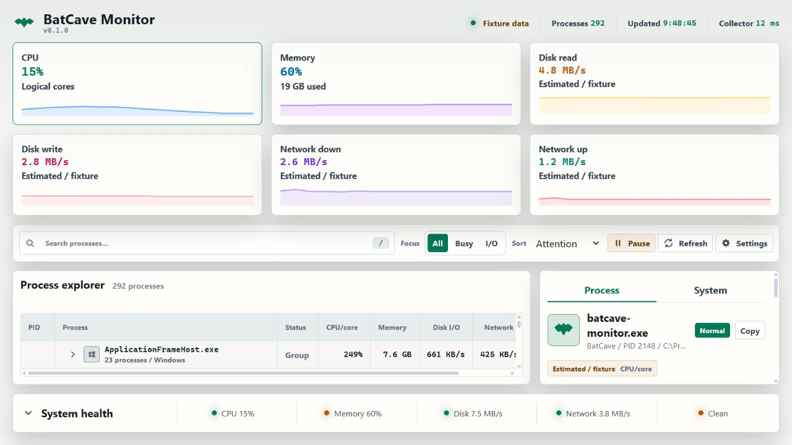
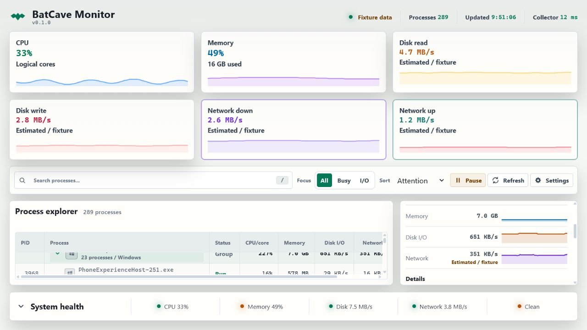
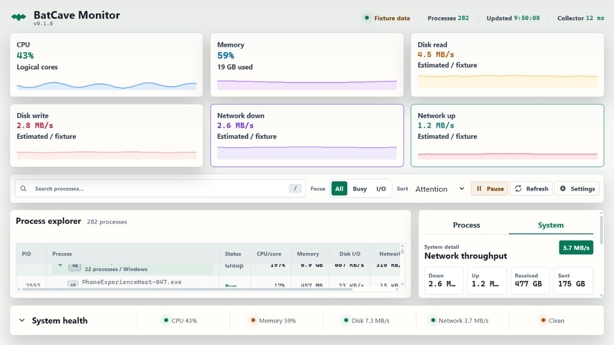
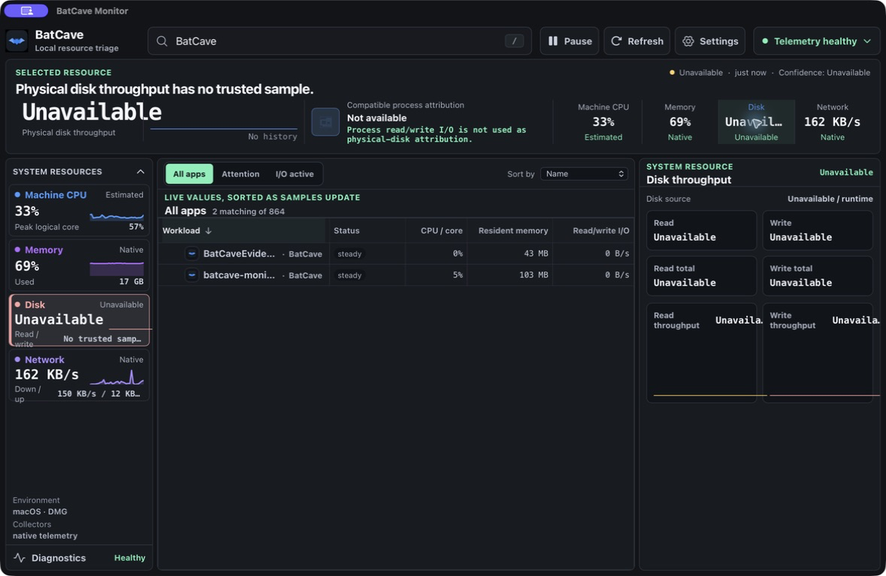
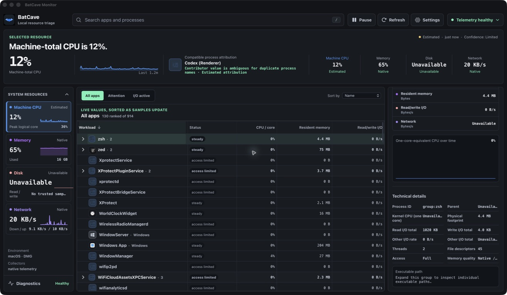
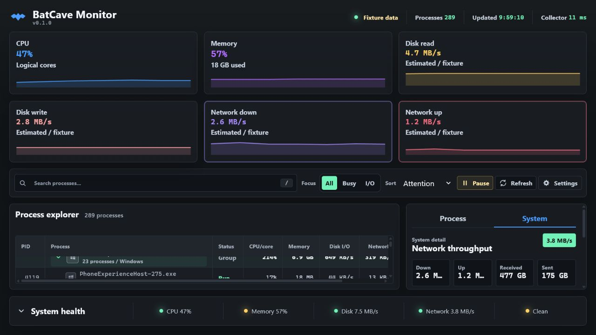

# BatCave Monitor

BatCave Monitor is a local-first resource cockpit for Windows and Linux. It shows the machine underneath the machine: CPU pressure, memory, disk and network movement, process triage, runtime health, and the little permission-shaped holes where the operating system says "not today."

This is a public preview. It is useful now, honest about what it cannot see, and intentionally boring about privacy: BatCave reads local telemetry and keeps it local.

### Light Theme







### Dark Theme







Screenshots show the native Tauri cockpit UI, grouped process inspector, and network detail view in both the light and dark themes. Browser fixture screenshots are layout-only and should not be used as product proof.

## What It Shows

- A live process explorer with expandable, selectable process groups and CPU, memory, disk/I/O, network, and thread columns.
- A system inspector for CPU, memory, disk, and network detail, including logical-core charts and runtime health.
- A selected process or process-group panel with live CPU, memory, disk, and network history. Process rows also show PID, parent PID, kernel CPU, private bytes, disk totals, thread count, handle count, access state, process path, and network attribution when available.
- Pause/resume, manual refresh, refresh cadence, search, sort, focus modes, chart history length, and theme controls.
- Explicit quality states when data is warming up, partially available, blocked by permissions, or unavailable on the current platform.

BatCave does not pretend. If ETW, eBPF, `/proc`, `/sys`, PDH, or process permissions are unavailable, the app keeps running and marks the affected metric honestly instead of painting fake numbers over the crack.

## Preview Status

BatCave is ready for source-based testing and local preview builds.

- Windows and Linux native telemetry collectors are implemented.
- The Tauri app can run as a native desktop shell or as a browser-only fixture UI for layout testing.
- Windows bundles currently produce an unsigned executable and NSIS installer.
- Linux builds produce `.deb` and AppImage bundles.
- Installer signing, offline Windows installer packaging, and automatic updater work are still future distribution work.

## Try It

Install prerequisites first:

- Node.js 24
- A current stable Rust toolchain
- On Windows, Microsoft Edge WebView2 Evergreen Runtime. The preview NSIS installer uses Tauri's default WebView2 `downloadBootstrapper`, so it can contact Microsoft during install if WebView2 is missing.
- On Linux, the WebKitGTK/GTK/Tauri native packages installed by `scripts/install-linux-deps.sh`

From the repository root on Windows:

```powershell
cd src\BatCave.App
npm install
cd ..\..
powershell -NoProfile -ExecutionPolicy Bypass -File scripts/run-dev.ps1
```

Run only the browser UI with deterministic fixture telemetry:

```powershell
powershell -NoProfile -ExecutionPolicy Bypass -File scripts/run-dev.ps1 -WebOnly
```

From the repository root on Ubuntu/Debian:

```bash
bash scripts/install-linux-deps.sh
cd src/BatCave.App
npm install
cd ../..
bash scripts/run-dev.sh
```

Run the Linux browser-only fixture UI:

```bash
bash scripts/run-dev.sh --web-only
```

## Validate And Build

Run the full Windows validation workflow:

```powershell
powershell -NoProfile -ExecutionPolicy Bypass -File scripts/validate-tauri.ps1
```

Run the Linux equivalent:

```bash
bash scripts/validate-tauri.sh
```

For faster app-level checks from `src/BatCave.App`:

```powershell
npm run verify
npm run tauri:dev:windows
npm run tauri:build:windows
```

On Linux, use:

```bash
npm run verify
npm run tauri:dev:linux
npm run tauri:build:linux
```

Windows release builds emit the release executable and unsigned NSIS installer under `src/BatCave.App/src-tauri/target/release`. The preview Windows installer expects WebView2 to be present or downloadable by the installer; managed/offline distribution should preinstall WebView2 or switch Tauri `bundle.windows.webviewInstallMode` to `offlineInstaller` or `fixedRuntime` before release. Linux builds emit `.deb` and AppImage bundles under `src/BatCave.App/src-tauri/target/release/bundle`.

## Privacy And Local Data

BatCave is local-only by design. Do not add outbound tracking, remote logging, hosted collection, or surprise network dependencies.

Runtime state, settings, warm cache, helper snapshots, and logs stay under:

- Windows: `%LOCALAPPDATA%\BatCaveMonitor`
- Linux: `$XDG_DATA_HOME/BatCaveMonitor` or `~/.local/share/BatCaveMonitor`

Theme preference is stored in browser `localStorage` under `batcave.monitor.theme`.

## Platform Notes

- Windows per-process network attribution uses ETW over the kernel TCP/IP provider. If the kernel logger cannot start or access is denied, BatCave reports the reason and continues.
- Windows admin mode can launch a local elevated helper for richer snapshots. If elevation is denied or unavailable, BatCave falls back to standard access.
- Linux aggregate telemetry uses `/proc` and `/sys`. Optional per-process network attribution uses `bpftrace`/eBPF when the host has the needed permissions or capabilities.
- Browser fixture mode is for UI work. It is deterministic on purpose and is not proof of native collector behavior.

## Benchmarks

Run a headless runtime benchmark:

```powershell
powershell -NoProfile -ExecutionPolicy Bypass -File scripts/run-benchmark.ps1 -BenchmarkHost core -Platform x64 -Ticks 120 -SleepMs 1000
```

Capture a reusable benchmark baseline artifact:

```powershell
powershell -NoProfile -ExecutionPolicy Bypass -File scripts/capture-benchmark-baseline.ps1 -BenchmarkHost core -Platform x64
```

Run the strict regression gate with either a matching baseline artifact or an explicit p95 budget. The normal validation scripts keep their fast smoke check; this gate is for release/local performance validation and writes a report under `artifacts/benchmarks`.

```powershell
powershell -NoProfile -ExecutionPolicy Bypass -File scripts/run-benchmark-gate.ps1 -BenchmarkHost core -Platform x64 -BaselineArtifactPath artifacts\benchmarks\baseline-core-YYYYMMDD-HHMMSS.json
powershell -NoProfile -ExecutionPolicy Bypass -File scripts/run-benchmark-gate.ps1 -BenchmarkHost core -Platform x64 -MaxP95Ms 10000
powershell -NoProfile -ExecutionPolicy Bypass -File scripts/validate-tauri.ps1 -SkipBundle -BenchmarkGate -BenchmarkMaxP95Ms 10000
```

Linux equivalents are available at `scripts/run-benchmark.sh`, `scripts/capture-benchmark-baseline.sh`, and `scripts/run-benchmark-gate.sh`.

In strict benchmark mode, the benchmark exits nonzero when `--max-p95-ms` or `--min-speedup-multiplier` gates fail. Use `capture-benchmark-baseline` to create a matching baseline summary before comparing runs.

## More Documentation

- [App runbook](src/BatCave.App/README.md) covers native/browser run modes, app scripts, and platform troubleshooting.
- [Runtime telemetry](docs/runtime-telemetry.md) covers the Rust runtime store, native collectors, quality states, admin helper behavior, and benchmark surfaces.

## Contributing

Keep the app local, explicit, and boringly reliable. Match the existing Rust/Tauri/Svelte boundaries, preserve the snake_case JSON contracts, and run the narrowest meaningful verification before opening a PR.
