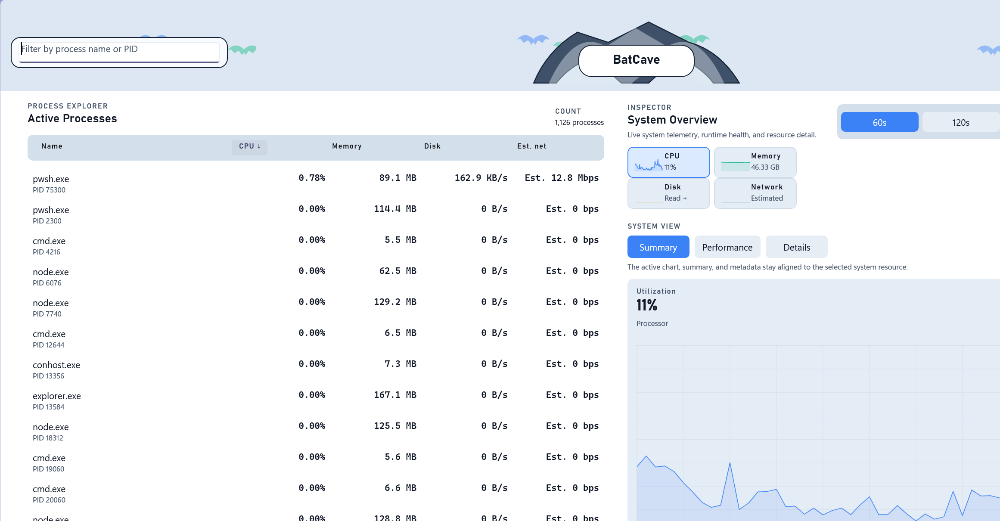
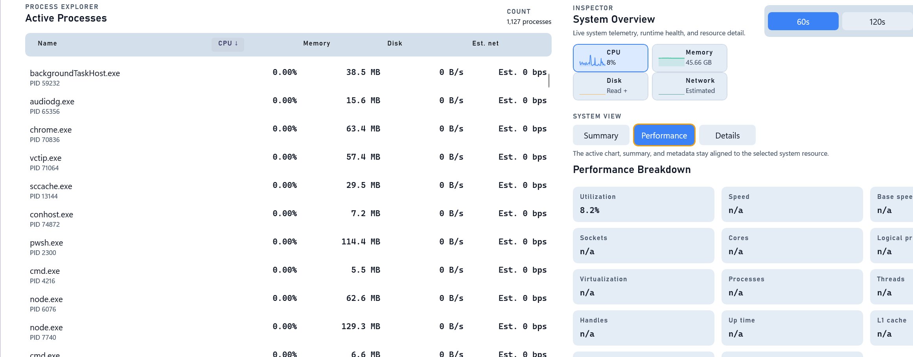

# BatCave

BatCave is a Windows 11 WinUI 3 process monitor built for fast, local-first telemetry and repeatable validation. It combines a live process explorer, system-level resource views, runtime health diagnostics, and benchmark gates in a single solution.

The app is designed to be useful both as an interactive desktop monitor and as a validation target for scripts, tests, and benchmark workflows. The repository also includes a headless benchmark host, runtime contract coverage, and WinUI-facing accessibility and layout tests.

## Screenshots





## Highlights

- Live process explorer with sortable CPU, memory, disk, and network/other I/O columns.
- Attention cockpit that surfaces the current CPU, memory, I/O, access, and highest-attention process leads before you dig into the table.
- Live CPU, logical-processor, memory, disk read/write, and network charts stay visible in the overview cockpit.
- Top-level workflow navigation for overview triage, process inspection, runtime health, and validation evidence.
- System overview with lightweight CPU, kernel CPU, per-core CPU, memory, disk, and network trend sparklines.
- Process inspector with dense process resource metrics, timeline-style process story text, context-menu actions, and stable selection.
- Dedicated runtime health workspace for jitter, dropped ticks, degrade mode, collector warnings, local data posture, access state, and the next action to take.
- Runtime health charts show tick p95, sort p95, and jitter p95 trends.
- Dedicated validation workspace that keeps benchmark and handoff commands visible with the latest local benchmark evidence.
- Admin-mode state preserved in the runtime store; elevated helper handoff remains a script-compatible CLI surface.
- Repeatable benchmark, baseline capture, validation, and memory-profiling workflows.
- Local-only persistence and logs under `%LOCALAPPDATA%\BatCaveMonitor`.

## Requirements

- Windows 11, build `22000` or newer.
- .NET SDK `10.0.103` or compatible feature roll-forward per `global.json`.
- PowerShell for the repository scripts.

BatCave targets `net10.0-windows10.0.19041.0`, but the runtime launch gate intentionally blocks startup on anything older than Windows 11.
The repository scripts accept `x86`, `x64`, and `ARM64` via `-Platform`.

## Quick Start

Build the full solution:

```powershell
dotnet build BatCave.slnx
```

Run the WinUI app unpackaged:

```powershell
powershell -NoProfile -ExecutionPolicy Bypass -File scripts/run-dev.ps1 -Platform x64
```

Run the test suite:

```powershell
dotnet test BatCave.slnx
```

BatCave starts with the runtime loop enabled, restores persisted sort/filter preferences, and prefers admin mode by default. You can toggle Admin Mode from the shell when the app is live.

## Common Workflows

Run the desktop app:

```powershell
powershell -NoProfile -ExecutionPolicy Bypass -File scripts/run-dev.ps1 -Platform x64
```

Run a headless benchmark against the core runtime:

```powershell
powershell -NoProfile -ExecutionPolicy Bypass -File scripts/run-benchmark.ps1 -BenchmarkHost core -Platform x64 -Ticks 120 -SleepMs 1000
```

Run the benchmark path through the WinUI host:

```powershell
powershell -NoProfile -ExecutionPolicy Bypass -File scripts/run-benchmark.ps1 -BenchmarkHost winui -Platform x64 -Ticks 120 -SleepMs 1000
```

Capture a reusable benchmark baseline artifact:

```powershell
powershell -NoProfile -ExecutionPolicy Bypass -File scripts/capture-benchmark-baseline.ps1 -BenchmarkHost core -Platform x64
```

Run the repository handoff gate:

```powershell
powershell -NoProfile -ExecutionPolicy Bypass -File scripts/validate-winui.ps1 -Platform ARM64
```

Run the validation gate with a strict performance comparison:

```powershell
powershell -NoProfile -ExecutionPolicy Bypass -File scripts/validate-winui.ps1 `
  -Platform x64 `
  -RunPerformanceGate `
  -BaselineArtifactPath artifacts\benchmarks\baseline-core-YYYYMMDD-HHMMSS.json
```

Profile memory growth while the unpackaged WinUI app runs:

```powershell
powershell -NoProfile -ExecutionPolicy Bypass -File scripts/profile-memory.ps1 -Platform x64
```

## CLI Diagnostics

The WinUI app also exposes CLI-oriented diagnostics for scripts and validation. The safest way to hit those surfaces is to use the existing WinUI run wrapper and pass app arguments through it.

Print launch gate status:

```powershell
powershell -NoProfile -ExecutionPolicy Bypass -File scripts/run-dev.ps1 -NoBuild -Platform x64 -AppArgs "--print-gate-status"
```

Print runtime health:

```powershell
powershell -NoProfile -ExecutionPolicy Bypass -File scripts/run-dev.ps1 -NoBuild -Platform x64 -AppArgs "--print-runtime-health"
```

Run the WinUI benchmark CLI path:

```powershell
powershell -NoProfile -ExecutionPolicy Bypass -File scripts/run-dev.ps1 -NoBuild -Platform x64 -AppArgs "--benchmark","--ticks","120","--sleep-ms","1000"
```

The JSON payloads use snake_case and are meant to stay stable enough for the validation and benchmark scripts already in this repo.

## Repository Layout

- `src/BatCave.App/`: WinUI 3 host, shell, focused controls, presentation adapter, app manifest, assets, and WinUI-facing CLI surfaces.
- `src/BatCave.Runtime/`: shared collectors, immutable runtime contracts, single-writer runtime store, reducer, launch policy, benchmark contracts, and local JSON persistence.
- `src/BatCave.Bench/`: headless benchmark host for runtime-only performance runs.
- `tests/BatCave.Runtime.Tests/`: xUnit coverage for runtime contracts, persistence recovery, JSON shape, bounded event coalescing, reducer behavior, and benchmark-facing contracts.
- `tests/BatCave.App.Tests/`: source-level coverage for WinUI shell contracts, native controls, accessibility names, and app identity settings.
- `scripts/`: repeatable local workflows for running, benchmarking, validating, and profiling the app.
- `artifacts/`: generated benchmark and memory-profiling output.

## Architecture At A Glance

BatCave is split so the monitoring engine stays reusable outside the WinUI shell:

```text
Windows process + system collectors
    -> single-writer runtime store
    -> bounded runtime delta/event stream
    -> UI store reducer
    -> WinUI render adapter
    -> desktop shell / benchmark runner / validation scripts
```

Key design points:

- `src/BatCave.Runtime` owns shared monitoring behavior so the same runtime can back both the UI and the benchmark host.
- `RuntimeSnapshot`, `RuntimeDelta`, and `RuntimeCommand` are the public boundary between collectors, scripts, benchmarks, and the WinUI adapter.
- The WinUI layer consumes runtime store output and reducer state; it does not call collectors or mutate runtime state directly.
- The runtime tracks health signals such as jitter p95, dropped ticks, collector warnings, and degrade mode.
- Global system sampling adds CPU, memory, disk, and network context alongside per-process telemetry.
- Persistence is intentionally local and lightweight: settings, warm cache, and logs live under `%LOCALAPPDATA%\BatCaveMonitor`.

## Data, Logs, and Privacy

BatCave is built around local-only storage:

- Settings: `%LOCALAPPDATA%\BatCaveMonitor\settings.json`
- Warm cache: `%LOCALAPPDATA%\BatCaveMonitor\warm-cache.json`
- Logs: `%LOCALAPPDATA%\BatCaveMonitor\logs`

The repository guidelines explicitly preserve local-only behavior and avoid outbound telemetry uploads.

## Contributing

If you are changing the runtime or UI, keep the solution boundaries intact:

- Put shared runtime, CLI, persistence, and collector behavior in `src/BatCave.Runtime`.
- Keep WinUI-only orchestration and presentation code in `src/BatCave.App`.
- Prefer minimal edits and preserve existing script and CLI contracts when possible.

Before opening a PR, run:

```powershell
dotnet test BatCave.slnx
```

For UI or runtime-affecting changes, also run:

```powershell
powershell -NoProfile -ExecutionPolicy Bypass -File scripts/validate-winui.ps1 -Platform x64
```

If you change benchmark behavior, capture or compare against a baseline under `artifacts\benchmarks`.
