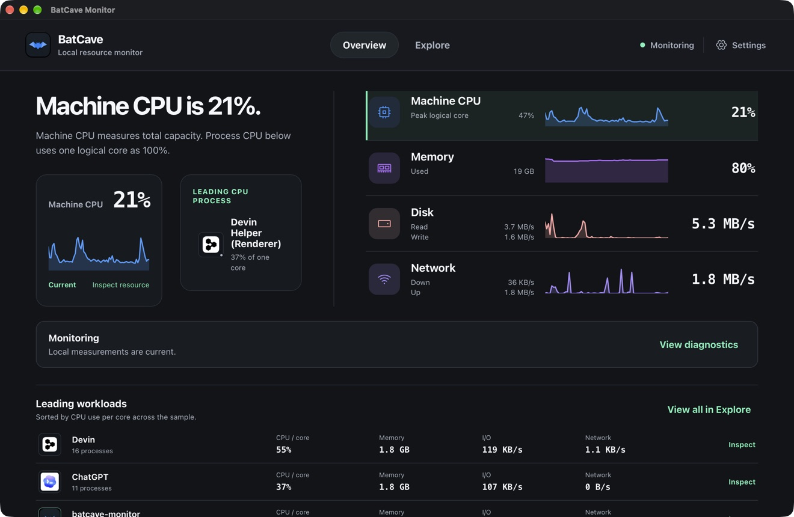
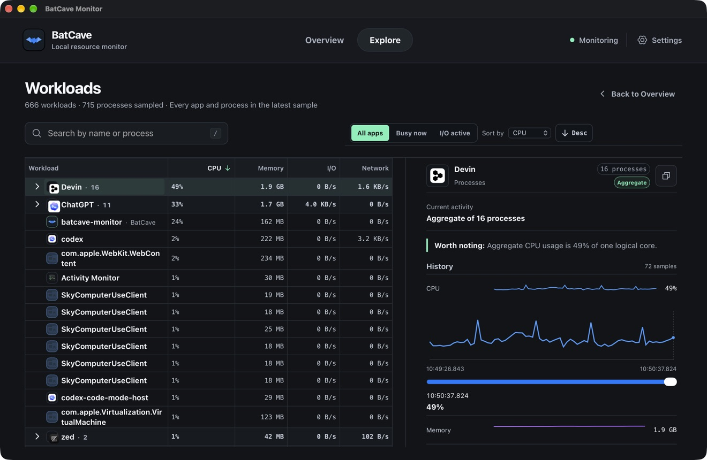

<p align="center">
  
</p>

<h1 align="center">BatCave Monitor</h1>

<p align="center">
  A local resource monitor for Windows, Linux, and Apple Silicon Macs.
</p>

BatCave shows machine-wide CPU, memory, disk, and network activity alongside the apps and processes using those resources. Select a workload to inspect its recorded history, measurement sources, and missing data.



<p align="center"><sub>Native Apple Silicon app, captured September 5, 2026. <a href="design-qa.md">Capture details</a>.</sub></p>

## Find the problem, then inspect it

- Compare machine activity with the workloads reporting the most usage.
- Rank grouped apps and individual processes by CPU, memory, disk, or network activity.
- Keep workload order stable while live values update, or refresh the ranking when you choose.
- Inspect a process or group without losing its history when you change the search or selection.
- Filter to workloads that need attention or are actively moving data.
- Check whether a measurement is native, estimated, limited, or unavailable.

If the operating system denies a process, a collector is still warming up, or a source cannot support a metric, BatCave says so. It does not turn missing telemetry into zeroes.



<p align="center"><sub>Explore shows the selected workload’s history, current readings, and measurement sources.</sub></p>

## Per-process network activity

Process-network attribution uses XNU NStat on supported macOS layouts, ETW on Windows, and optional eBPF probes on Linux. It measures IP socket payloads. If the collector lacks access or does not support the host, BatCave marks process traffic unavailable.

## Platform support

| Platform | Release target | Machine telemetry | Per-process network | Package |
| --- | --- | --- | --- | --- |
| Windows | Windows 10 `10.0.16299`+, x86-64 | Win32 and PDH | ETW; installed service for protected collection | NSIS |
| Linux | Ubuntu 22.04+ or Debian 12+, x86-64 glibc | `/proc` and `/sys` | Optional bpftrace/eBPF | deb, AppImage |
| macOS | macOS 12.0+, Apple Silicon | sysinfo, libproc, IOKit | XNU NStat | DMG, updater archive |

Intel Macs, Windows ARM64, Linux ARM64, musl, and unlisted operating-system profiles are not supported release targets. See [Platform capabilities](docs/platform-capabilities.md) for source coverage, permissions, failure behavior, and verification status.

## Get BatCave

BatCave is in preview. [GitHub Releases](https://github.com/TheGreenCedar/BatCave/releases) lists published builds. To run from source, use the commands below.

You will need Node.js 24 and a current stable Rust toolchain. Linux also needs the native Tauri dependencies installed by `scripts/install-linux-deps.sh`. macOS development requires Apple Silicon, Xcode Command Line Tools, and the `aarch64-apple-darwin` Rust target.

### macOS or Linux

```bash
# Linux only
bash scripts/install-linux-deps.sh

cd src/BatCave.App
npm install
cd ../..
bash scripts/run-dev.sh
```

On macOS, add the target once with `rustup target add aarch64-apple-darwin`. To enable optional Linux process-network attribution, install the extra probe with `bash scripts/install-linux-deps.sh --with-bpftrace`.

### Windows

```powershell
cd src\BatCave.App
npm install
cd ..\..
powershell -NoProfile -ExecutionPolicy Bypass -File scripts/run-dev.ps1
```

The Windows installer includes the WebView2 Evergreen runtime for offline installation. Existing public Windows preview artifacts are unsigned. Production signing requires the certificate and public-download checks in [Release channels and verification](docs/releases.md).

## Build and verify

Run the platform validation workflow from the repository root:

```bash
# macOS or Linux
bash scripts/validate-tauri.sh
```

```powershell
# Windows
powershell -NoProfile -ExecutionPolicy Bypass -File scripts/validate-tauri.ps1
```

These workflows cover the frontend checks, Rust formatting and tests, and the native bundle. macOS produces an Apple Silicon build only.

For layout work with deterministic sample data, use `bash scripts/run-dev.sh --web-only` or the Windows `-WebOnly` switch. Verify telemetry in the native app.

## Local data

BatCave keeps settings, cache, and logs on your machine. It has no analytics, telemetry upload, remote logging, or background update checks. Use **Check now** in Settings to check for a release. Optional local AI models require a separate download action on Windows and Linux.

Local state lives under:

- Windows: `%LOCALAPPDATA%\BatCaveMonitor`
- Linux: `$XDG_DATA_HOME/BatCaveMonitor` or `~/.local/share/BatCaveMonitor`
- macOS: `~/Library/Application Support/BatCaveMonitor`

See [Current-user state](docs/current-user-state.md) for ownership, retention, permissions, and cleanup behavior.

## Project status

The app builds for all three supported platforms. Testing on the oldest supported hosts, installed-package checks, and release signing remain separate requirements. The [rescue implementation notes](docs/rescue-implementation.md) record current behavior, performance results, and unfinished verification. See [Release channels and verification](docs/releases.md) for release requirements.

## Documentation

- [App runbook](src/BatCave.App/README.md): development, validation, and troubleshooting
- [Runtime telemetry](docs/runtime-telemetry.md): collectors, quality states, history, and benchmarks
- [Platform capabilities](docs/platform-capabilities.md): supported sources, permissions, packages, and architectures
- [Release channels and verification](docs/releases.md): versioning, signing, publication, and updates
- [Microsoft Store EXE preparation](docs/store/windows-submission-checklist.md): package checks and submission requirements

## Contributing

Keep telemetry and storage local. Preserve the Rust/Tauri/Svelte boundaries and snake_case runtime contracts. Test the behavior you change, including how it fails, and use native app evidence for telemetry and visible UI changes.
