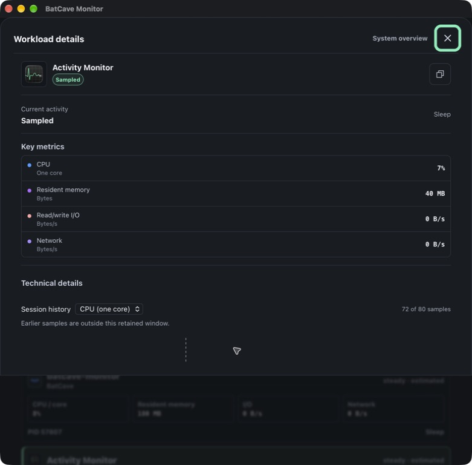

# Native UI evidence

These screenshots show the native Apple Silicon app with live local telemetry on September 5, 2026. They cover Overview, Explore, and the compact workload inspector after the resource-readout and macOS network-collection fixes.

| Capture | Details |
| --- | --- |
| Source | `7242f3c186d59ab6fbbbfbdbdacf133ae41816f4` |
| App | BatCave Monitor `0.2.0-rc.5`, local ad-hoc build |
| Host | Apple Silicon, macOS 27.0, build `26A5421a` |
| Appearance | Cave, system dark mode |
| Method | Direct native-window captures through Computer Use |
| Window sizes | Overview and Explore: 1179 × 768; compact inspector: 781 × 768 |
| GUI SHA-256 | `2cc809444c0dda04bbfb1a8034a129f1d655098518bf04c3a3e3f717b9b03cfe` |

The captured app predates the PostCSS dependency update; its UI and collector source match the final PR. The images are unedited native captures, not browser fixtures or mockups.

## Overview

Read and write rates occupy separate lines, keeping each value beside its unit as activity changes. Network download and upload rates use the same layout.

## Explore

The selected workload keeps its inspector and recorded history beside the ranked list.

## Compact inspector

At a narrow window width, workload details open in a drawer. Native verification covered scrolling to the history chart, closing with Escape, and returning focus to the selected workload.

The final native session showed live process network activity and no active collector limitation. Diagnostics still lists unavailable macOS kernel CPU as a data limitation. These captures establish visible behavior; performance budgets and signed release verification remain separate requirements in [the implementation record](docs/rescue-implementation.md).
