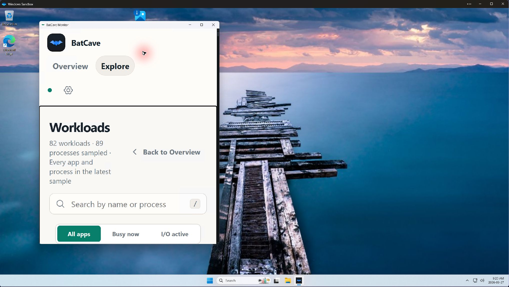
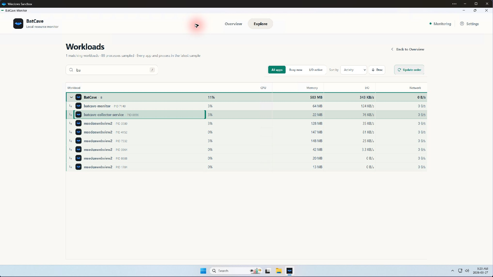
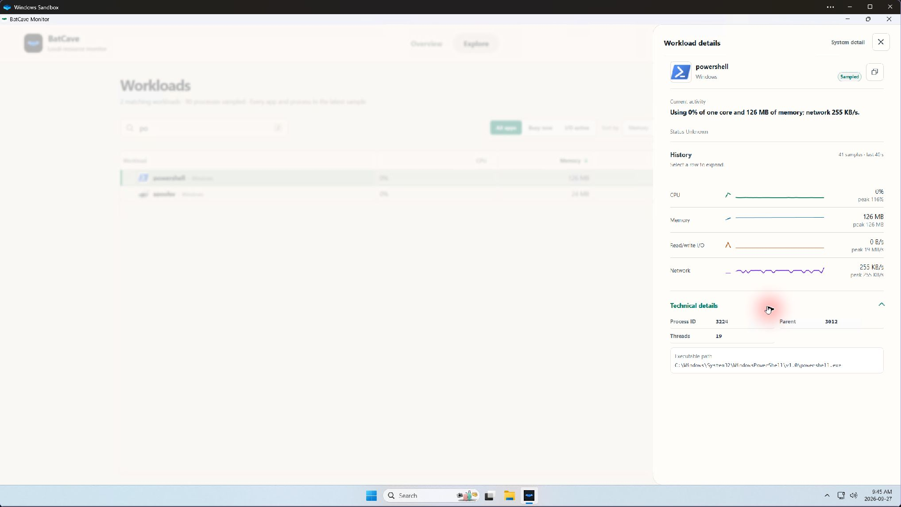

# Native UI evidence

## View navigation regression, September 27, 2026

The installed `c54363d344e8b65459e9515b5a0c77ff931814bd` candidate exposed a compact-view navigation defect. At 720-pixel content width with enlarged text, Return on the focused Leading workloads action replaced Overview with Explore while retaining the outer document scroll. The client area showed the theme background and scrollbar. One Ctrl+Home restored the rendered Explore view without reload or a process-generation change; this observation does not establish a WebView crash.

View changes now reset the document scroll after the destination mounts and focus its main landmark. The `/` shortcut focuses search; workload and resource drill-down retain the inspector's initial-focus and close-focus behavior. Competing navigation invalidates stale deferred focus work. Query and workload selection are preserved.

The automated regression starts from a scrolled narrow Overview, activates the action by keyboard, checks the visible destination and scroll position, and exercises navigation, retained search text and inspector dismissal. Browser fixture comparisons are layout diagnostics only. The installed successor below verifies the corrected path separately from the historical source-built captures.

## Installed Windows successor, September 27, 2026

The raw native captures below show a local candidate installed in a disposable Windows 11 Enterprise build 26100 guest. This candidate is not a published release. Its source is `1b00f5c6b89b0e35c57b05955e0b2e84cac9df23`; later integration changes are limited to test fixtures and this evidence record. Production and build inputs are identical.

| Installed artifact | SHA-256 |
| --- | --- |
| NSIS installer | `83eafabd32e2881b1cf6ba2cd5ec780d7e9298d661fad454bc8ee1b0c21d6ced` |
| Embedded and installed monitor | `f4947bd8abc4d940a6389fb5308bf6a5c9a3c1076d03ba2185ac575d92166031` |
| Installed collector | `b6830d1b08af553fe4f6e18b589e4741a97e68597518915bc5b4ab997b220ff3` |

The installer created the shared Start entry and its protected ownership receipt. Invoking that entry launched monitor PID 7140, generation 1790514573543, with a standard-user Medium token. No elevation prompt appeared on ordinary launch. The LocalSystem collector PID 8696 supplied current protected samples to that desktop; Diagnostics reported the installed collector, active collection and no fallback. These observations do not measure installer consent on a UAC-enabled host.

At the 720-pixel outer frame, five Ctrl+= increments from Ctrl+0 visibly enlarged text to the nominal 200% setting; no direct zoom-factor API receipt was collected. Tab reached the scrolled Overview action; Return immediately displayed Explore at document top and focused its main landmark. The next Tab reached Back to Overview. No Ctrl+Home or reload was needed. Search retained the query through navigation, slash selected it, and inspector Close/Tab/Escape preserved the selected workload and visible focus.

The expanded workload contains eight distinct observed process identities: the monitor, authenticated collector and six verified WebView descendants. Each component remains individually inspectable. Existing source tests establish exactly-once aggregate/filter scope; the rounded screenshot values are not an instantaneous arithmetic reconciliation.

One bounded HTTPS read discarded 6,088,964 bytes in 60 seconds and produced observed rates of 94, 129 and 255 KB/s for requester PID 3224, generation 1790516710124. The screenshot binds the displayed rate to that requester's PID, parent and executable path. The requester ran elevated; the monitor remained the independently verified standard-user process receiving installed-service samples. This proves visible per-process traffic through that desktop/service path, not every network quality state. The earlier 10-second request completed successfully but its post-transfer screenshot missed nonzero traffic and is not counted as that proof.

Stopping the collector removed its process and ETW lease. Diagnostics reported no privileged source, unavailable protected collection and current standard fallback; the group contained seven members. Restart created collector PID 8948, generation 1790516893849. The unchanged standard-user monitor reconnected without UAC and the group returned to eight distinct members. Current protected collection and no fallback were restored. Quiet network evidence after restart was Pending, not an invented zero; no second nonzero transfer after restart is claimed.

Quiet network evidence also appeared as unavailable/Partial rather than an invented rate, then showed zero after callbacks resumed. The guest occasionally reported sampling delay with collector p95 1587.7ms while the service stayed connected; this is separate from the validation host's 165.8ms smoke result. The motion observer found animations already disabled and confirmed restoration to that same value. Its parent could not read the child exit code, so the helper failure is retained; no enabled-to-disabled transition is claimed.

The exact installed uninstaller exited successfully after the owned app closed. Product processes, service, install root, ETW lease, App Paths, shared Start entry, staging leaf and ownership receipt were absent afterward. No per-user BatCave entry was left in the observed standard-user profile. The guest was retired; retained host checks found the same installed executable hashes, preferences hash and running service PID/state. Privileged host process-image identity was unavailable and is not inferred from its PID. These results qualify the observed local candidate behavior; public release, oldest-supported-host and broader installer fault-path proof remain separate.

## Windows inspector and enlarged text, September 26, 2026

These raw Computer Use captures show the source-built Windows app with production frontend assets and live local telemetry. Explore uses the full table width while the inspector is closed; selecting a workload opens the dismissible side drawer at wide and compact sizes.

| Capture | Details |
| --- | --- |
| Source | `493e6e0e5882f671e9809505831e1dc7a863e421` |
| App | Tauri debug build with production frontend assets; not an installed release |
| Method | Unedited native Computer Use window captures |
| Window sizes | Wide: 1322 x 891; compact: 722 x 891, with 720-pixel content width |
| Enlarged text | Ctrl+0 followed by five Ctrl+= increments; input sequence and visible enlargement observed, no direct zoom-factor API receipt |
| GUI SHA-256 | `9aadc4eee30297c162a505cc459362954c93bef4eca0f32f327b5768ae51e77f` |

The byte-identical executable copy was named `batcave-layout-493e6e0.exe` to avoid a Computer Use registration collision with an older installation. Its PID and executable path were verified before interaction. That filename appears in the filtered screenshots. Standard-access collection remained active; the installed collector service was unchanged. The warning shown here does not establish installed collector pairing or release performance.

Across the unchanged inspector at `5acf517` and `493e6e0`, native interaction covered Close, Escape, backdrop dismissal, Tab navigation, returning focus to the selected workload, reopening with Return and preserving the open inspector during resize. Backdrop and resize-focus evidence comes from `5acf517`. Enlarged native checks also covered the wrapped app header, Leading workloads action, and paused Settings actions. Earlier source `83a9f236` established stable resource/status positions across CPU, Memory, Disk, pause and resume, and keyboard scrolling of long status text. Routine CPU digit jitter was not reproduced in the baseline; no separate fix is claimed for it.

These captures identify their source and executable rather than qualifying an installed update. The installed candidate, collector lifecycle, other native platforms and release qualification remain separate evidence gates. Browser fixture checks cover additional deterministic layout and quality cases and are not native screenshots.

The final action-width correction at `049fbed54a7e1f4d359178dff5f3f6bd580e1d1b` constrains the Leading workloads action for wider fonts after hosted Linux exposed intrinsic overflow. It leaves the inspector and Settings behavior captured above unchanged. The screenshot below comes from that successor's native debug build, SHA-256 `98d79762eae6bb47c00a1f45b1f6412bd496d716287ac50f0b4162f68da4958d`, with the same enlarged-text input sequence. The action stays within the window and its click navigates to filtered Explore.

The successor also exercised a real expanded group beside standalone rows, changing ranking and filtering by a member PID while preserving group and child selection, then dismissing and reopening details by keyboard. Natural CPU changes from 11% to 6% and disk readings from 55 to 325 to 617 KB/s did not move the observed geometry. A total-rate KB/s-to-MB/s transition did not occur during the bounded session; reduced-motion native execution was not observed. Deterministic browser checks cover those remaining cases without being presented as native proof. Monitoring resumed, zoom reset, and original preferences were restored after the owned process closed.

## Historical macOS evidence, September 15, 2026

These screenshots show the native Apple Silicon app with live local telemetry on September 15, 2026. They cover Overview, Explore, and the compact workload inspector after the ranking, status-strip, and inspector changes in this revision.

| Capture | Details |
| --- | --- |
| Source | `9570141` (`devin/1789304882-ux-findings`) |
| App | BatCave Monitor `0.2.0-rc.5`, local `tauri dev` debug build |
| Host | Apple Silicon, macOS 27.0, build `26A428` |
| Appearance | Cave, system dark mode |
| Method | Direct native-window captures (`screencapture -l`) of the running Tauri window, downscaled from 2x to 1x |
| Window sizes | Overview and Explore: 1320 × 860; compact inspector: 781 × 768 |
| GUI SHA-256 | `f183778b475900301b94dd7008dfc92aa1f24c8c7626a8a4ef9c97968fb275d4` (debug binary) |

The images are unedited native captures, not browser fixtures or mockups.

### Overview

The status strip under the resource cards is always present, so a monitor warning changes its color rather than pushing Leading workloads down. Rankings settle: near-tied rows keep their positions between samples.

### Explore

The inspector shows the selected workload's history for all four resources as thin strips with their latest values. Selecting a strip expands it into the scrubbable chart. Technical details are limited to process identity.

### Compact inspector

At a narrow window width, workload details open in a drawer with the same history strips. Native verification covered expanding a strip, closing with Escape, and returning focus to the selected workload card.

The capture session ran with live process network activity. Diagnostics still lists unavailable macOS kernel CPU as a data limitation. These captures establish visible behavior; performance budgets and signed release verification remain separate requirements in [the implementation record](docs/rescue-implementation.md).
