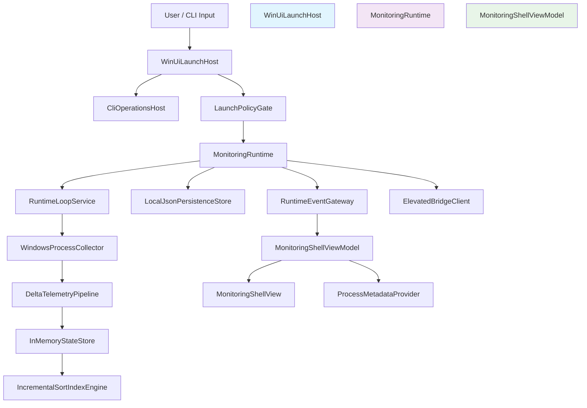

# Architectural Blueprint

## 1. Core Objective
Port AlbertsCave from Tauri + Rust + React into BatCave as a native WinUI + .NET desktop application that preserves full v1 monitoring behavior, including Windows 11 startup gating, 1-second process telemetry, identity-safe delta updates, runtime-health diagnostics, admin elevation mode, and local-only persistence/diagnostics under dual packaged and unpackaged deployment modes.

## 2. System Scope and Boundaries

### In Scope
- Port the full v1 telemetry runtime, including collector, pipeline, state, sort/filter query engine, and runtime loop.
- Build a native WinUI shell with process table, detail panel, runtime health footer, startup blocked/error states, and retry flow.
- Implement admin mode runtime restart with elevated helper bridge and warnings.
- Preserve CLI operational modes for startup gate print and benchmark summary output.
- Support packaged and unpackaged WinUI deployment paths from the same codebase.

### Out of Scope
- Any process-control actions (kill/suspend/priority/affinity), consistent with monitor-only v1.
- Cross-platform support beyond Windows 11.
- Visual pixel parity with the previous React design system.
- Cloud telemetry, outbound diagnostics, or remote management services.

## 3. Core System Components
| Component Name | Single Responsibility |
|---|---|
| **WinUiLaunchHost** | Bootstrap app startup, DI container, and window activation lifecycle. |
| **CliOperationsHost** | Parse and execute CLI-only operational modes before UI startup. |
| **LaunchPolicyGate** | Enforce startup policy (Windows platform + Windows 11 build gate). |
| **MonitoringRuntime** | Own collector, pipeline, state, sort, persistence, and runtime health state transitions. |
| **RuntimeLoopService** | Execute the 1-second scheduler loop, jitter tracking, and event dispatch cadence. |
| **WindowsProcessCollector** | Collect per-process CPU/memory/IO/thread/handle/access metrics each tick. |
| **ElevatedBridgeClient** | Provide admin-mode elevated helper bridge lifecycle and snapshot polling/fault handling. |
| **DeltaTelemetryPipeline** | Convert raw tick samples into identity-safe upserts/exits with heartbeat behavior. |
| **InMemoryStateStore** | Maintain current live process rows and warm-cache export/import state. |
| **IncrementalSortIndexEngine** | Serve query snapshots with incremental ordering updates and filtering. |
| **LocalJsonPersistenceStore** | Persist settings/warm cache/diagnostic artifacts under local app-data. |
| **ProcessMetadataProvider** | Fetch parent PID, command line, and executable path for selected process identity. |
| **RuntimeEventGateway** | Surface telemetry delta, runtime health, and collector warning events to the UI layer. |
| **MonitoringShellViewModel** | Coordinate UI state, user interactions, and runtime/service orchestration. |
| **MonitoringShellView** | Render native WinUI shell for top bar, list/detail composition, and health footer. |

## 4. High-Level Data Flow

## 5. Key Integration Points
- **WinUiLaunchHost ↔ CliOperationsHost**: in-process command-line argument routing.
- **WinUiLaunchHost ↔ LaunchPolicyGate**: in-process startup policy evaluation before runtime activation.
- **MonitoringRuntime ↔ RuntimeLoopService**: in-process scheduler callback contract (`tick`, `recordDroppedTicks`).
- **RuntimeLoopService ↔ RuntimeEventGateway**: in-process event publication (`telemetry_delta`, `runtime_health`, `collector_warning`).
- **MonitoringRuntime ↔ WindowsProcessCollector**: in-process process-sample collection contract.
- **MonitoringRuntime ↔ ElevatedBridgeClient**: helper bridge IPC via local tokenized snapshot files and stop signal files.
- **MonitoringRuntime ↔ LocalJsonPersistenceStore**: JSON file persistence for settings and warm cache.
- **MonitoringShellViewModel ↔ IncrementalSortIndexEngine**: query snapshots with sort/filter options.
- **MonitoringShellViewModel ↔ ProcessMetadataProvider**: on-demand metadata lookup by `(pid,start_time_ms)`.
- **Authentication**: OS-level elevation/UAC for admin-mode helper launch; no external auth.
- **Data Format**: JSON payloads for local persistence and CLI output; strongly typed .NET domain objects in-process.
