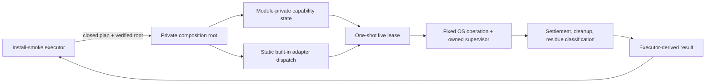

# Private native artifact consumption authority

- Status: accepted architecture for issues #110, #113, #114, and #115
- Date: 2026-07-14
- Source decision: issue #130 at integration base `70a4aa839f6b4568bf0ad97e2b476f13e8f77042`
- Prototype only: no package is installed, mounted, staged, or launched by this decision

## Decision

Keep exact artifact bytes and every operation that can reveal or consume them behind one statically composed, process-local authority. The authority owns the private file or operating-system handle, imports the built-in platform adapters itself, and gives an adapter a one-shot lease only while it runs a fixed profile operation. It never returns the authority, lease, private path, raw handle, command, callback, or adapter registry through an exported API.

The exported executor surface may select a closed platform profile and start or cancel the complete operation. It cannot register an adapter, supply a command, pass a callback, choose a result, or obtain a byte-consumption primitive. An opaque capability is only a `WeakMap` key; copying its visible metadata does not recreate its private state.

The production composition should have this shape:



The authority stays live from verified-byte acquisition through tool consumption, complete process settlement, cleanup, and residue inspection. It closes only after those boundaries settle. A timeout or unresolved process tree retains the private resources for recovery and emits no proof.

This is one authority mechanism with platform-specific byte transports. Windows, Linux, and macOS tools do not all accept the same kind of input, so the security invariant is the private lease and closed dispatch—not a false universal “file descriptor works everywhere” rule.

## Current gap

`native-artifact-capability.mjs` correctly owns a private copy behind a `WeakMap`, rehashes it, and returns only a process-local verification receipt. `native-install-smoke-executor.mjs` then binds source descriptors and closes the capability. Linux and macOS descriptors therefore describe future tools but cannot consume the live private bytes. `nativeExecutionReceipts` is intentionally unreachable.

Exposing the current private path or handle would make native execution reachable, but it would also let an ordinary caller replace the fixed adapter, run a different command, consume unrelated bytes, close too early, or claim settlement it did not own. The missing seam must be added inside the trust boundary rather than around it.

## Threat boundary

### In scope

- ordinary same-process JavaScript callers importing every exported repository module;
- callers passing extra flags, functions, commands, environments, paths, descriptors, handles, statuses, observations, or evidence;
- copies or reconstructions of frozen capability and adapter metadata;
- a capability, plan, verification receipt, profile, or asset from a different process-local operation;
- concurrent consumption, replay, close-before-use, and close-during-use;
- replacement of the original public path after acquisition;
- replacement of the private path before or during a path-based tool operation;
- timeout, parent exit with descendants, partial execution, failed termination, cleanup failure, and residue;
- source or fixture results being relabelled as native/public proof.

### Trust assumptions

- the reviewed repository build and static ESM import graph are trusted;
- Node, Rust, the operating-system loader, and the selected fixed platform tools are within the release-host trust boundary;
- an attacker cannot replace repository modules or install a hostile ESM loader before this code starts;
- arbitrary native code execution, debugger/inspector access, or monkey-patching Node built-ins before module evaluation is process compromise and is outside this API boundary;
- a separate malicious process running as the same operating-system user is not isolated by Unix mode bits alone. Platform adapters must still prevent or detect replacement while a path-based tool consumes bytes.

The ordinary-caller claim is deliberately narrower than “secure against arbitrary code already executing inside the process.” JavaScript closures and `WeakMap` brands are capability boundaries for reviewed modules; they are not a sandbox.

## Authority and adapter contract

### Composition

1. The private composition root statically imports each built-in adapter factory. There is no exported registration API, dynamic module name, plugin path, or caller-supplied factory.
2. The root creates one non-exported authority facade and passes it to the exact imported factories during module initialization. Calling a factory through an ordinary import with a fake facade cannot register work with the real root or create a recognized result.
3. Capability state remains in a module-private `WeakMap`. The visible capability contains only frozen plan/profile/asset metadata and is never evidence.
4. The root looks up the exact capability object, exact plan identity, exact verification receipt, and closed profile before it creates one lease.
5. The lease is consumed once. It is not returned to the executor and cannot be serialized, cloned, replayed, or transferred to a worker or subprocess.

Linux and macOS implementations may live in separate adapter modules and proceed independently. They share only the private facade contract and result taxonomy; neither module exports a usable authority or byte path.

### Closed operation

An adapter receives private methods for its fixed profile only. The facade may let it:

- retain the exact private file/handle identity;
- launch one fixed executable or invoke one fixed in-process extractor with tokenized arguments;
- supervise the owned process tree;
- record internally derived trust/runtime observations;
- request cleanup after settlement; and
- return a private structured observation to the composition root.

It does not receive a general `spawn`, `exec`, arbitrary argument, arbitrary environment, raw path getter, raw handle getter, callback, evidence builder, or status setter.

The composition root—not the adapter or caller—derives the ordered gate result. Only the production executor may later turn a complete, internally branded native execution receipt into `native_proven` and a sanitized #98 packet.

## Lifetime and state machine

```text
acquiring
  -> acquired
  -> leased
  -> consuming
  -> settling
  -> inspecting_residue
  -> cleaning
  -> closed

Any phase -> failed, but resources close only after settlement is known.
settling unresolved -> retained_unsettled (no close, no delete, no proof)
cleanup failed      -> retained_cleanup_failed (no proof)
```

Rules:

- Acquisition copies or otherwise captures exact verified bytes before the public path can matter again.
- A lease can be issued once. A second request, concurrent request, equivalent capability object, or different receipt fails as replay.
- Close before leasing invalidates the operation. Close while consuming or settling is rejected; it cannot interrupt ownership.
- The authority retains the byte handle and private root until every owned process is closed and the process tree is settled.
- A normal parent exit is incomplete if an owned descendant remains.
- Soft termination escalates to hard termination within the plan's bound. Cleanup starts only after settlement is confirmed.
- Residue inspection covers owned processes, package-specific mounts/staging roots, application copies, and the declared user-state policy.
- Unresolved settlement retains resources instead of deleting paths still used by a child.
- Cleanup attempts every safe owned resource and preserves primary, settlement, residue, and cleanup failures together.

## Failure taxonomy

| Boundary    | Examples                                                                                 | Required result                                                        |
| ----------- | ---------------------------------------------------------------------------------------- | ---------------------------------------------------------------------- |
| Acquisition | wrong bytes, link escape, root/source replacement, mismatched plan/receipt               | `acquisition_failed`; no lease or proof                                |
| Authority   | forged capability, wrong profile, caller callback/path/command, reconstructed descriptor | `authority_rejected`; no process starts                                |
| Consumption | fixed tool cannot open bytes, destination trust drift, private identity changes          | `consumption_failed`; settle anything started                          |
| Timeout     | step deadline expires                                                                    | `timeout`; terminate and settle, never reinterpret as ordinary failure |
| Settlement  | child or descendant ownership remains unresolved                                         | `retained_unsettled`; no cleanup or proof                              |
| Cleanup     | unmount/remove/close/delete fails after settlement                                       | `cleanup_failed`; preserve the other outcome and no proof              |
| Residue     | owned process, mount, staged app, installed app, or forbidden state remains              | `residue_failed`; no proof                                             |
| Unsupported | host/tool/transport cannot satisfy the closed contract                                   | `unsupported`; no fallback command or weaker proof                     |

A result may contain more than one failure boundary. Cleanup must not overwrite a timeout, consumption error, or residue observation.

## Platform byte-consumption contracts

The following table defines the implementation target. It is not evidence that the host tools already satisfy it.

| Profile               | Practical consumption need                                                                 | Authority contract                                                                                                                                                                                                                                           | Required implementation evidence                                                                                                         |
| --------------------- | ------------------------------------------------------------------------------------------ | ------------------------------------------------------------------------------------------------------------------------------------------------------------------------------------------------------------------------------------------------------------ | ---------------------------------------------------------------------------------------------------------------------------------------- |
| Windows NSIS          | `CreateProcessW` requires an executable path, not an existing file handle                  | Hold a Windows handle opened without write/delete sharing, recheck file ID, launch the exact private path through fixed `CreateProcessW`, and assign the process to an owned Job Object before accepting execution                                           | replacement/delete denial, exact image identity, UAC outcome, full Job settlement, uninstall and residue tests                           |
| Linux deb             | `dpkg` consumes a package pathname and may run maintainer-script descendants               | First test an inherited read-only descriptor exposed only as `/proc/self/fd/N`; if supported, keep it live through the supervised process group. Otherwise use a private path while retaining and rechecking its descriptor identity before and after `dpkg` | supported-host descriptor/path experiment, package database lock behavior, descendant settlement, checksum/attestation and removal gates |
| Linux AppImage        | the image is directly executable and its runtime may depend on its own executable identity | Prefer `fexecve`/`execveat` or an inherited `/proc/self/fd/N` transport if the real AppImage runtime preserves mount/update behavior; otherwise execute the locked private path with pre/post identity checks                                                | real AppImage transport spike, runtime mount/process settlement, updater limitation, removal and residue tests                           |
| macOS DMG             | `hdiutil attach` normally consumes an image path                                           | Test whether an inherited `/dev/fd/N` is supported. If not, hold the descriptor, use a private non-exported path, verify identity around attach, own a private mount point, and detach only after every consumer settles                                     | real universal DMG attach experiment, replacement detection, mount ownership, contained-app trust and cleanup                            |
| macOS updater archive | the safe extractor can be implemented in process and need not reopen a caller path         | Read only from the authority-held handle/stream into a private extraction root; reject links, traversal, collisions, and budget overflow before staging                                                                                                      | hostile archive suite bound to the live handle, contained-app identity/trust, staging-only limitation and cleanup                        |

Path-based transports have a residual same-user race on Unix-like systems because advisory locks and directory modes do not stop arbitrary code running as the same user. The Linux and macOS children must prefer inherited descriptor/stream consumption where the real tool supports it and must record any remaining path assumption. A post-operation identity check detects drift but cannot undo side effects, so detection alone is insufficient against an in-scope replacement attacker.

## Prototype

[`native-artifact-consumption-authority.prototype.mjs`](../../scripts/native-artifact-consumption-authority.prototype.mjs) is isolated from the production executor. It demonstrates:

- a module-private `WeakMap` authority and opaque frozen capability key;
- exact-byte copy and retained handle ownership;
- closed Windows, Linux deb/AppImage, macOS DMG, and macOS updater profile identifiers;
- one fixed non-installing child process with no caller command, arguments, environment, path, handle, callback, descriptor, status, or evidence input;
- replay and early-close rejection;
- original-path independence and private-path identity checks;
- timeout termination, settlement, cleanup, and residue classifications; and
- process-local prototype result branding that can never emit a native execution receipt or release evidence.

The fixed child only reads and hashes the private copy after a short delay. It does not execute the selected artifact as code and does not install, mount, extract, stage, launch, or remove a package. Its process supervision models the lifetime contract but is not a Windows Job Object, Linux package process-tree, AppImage mount, or macOS mount proof.

Run:

```sh
node --test scripts/native-artifact-consumption-authority.prototype.test.mjs
node --test scripts/native-install-smoke-executor.test.mjs
node --test scripts/linux-native-install-smoke-adapter.test.mjs
```

## Considered alternatives

### Return the private path or raw handle

Rejected. An ordinary caller could reopen different bytes, pass the path to an arbitrary command, close ownership early, or pair one receipt with another execution. A “do not misuse this” convention is not a capability boundary.

### Accept an adapter callback or dependency-injected command runner

Rejected. Function identity, callback output, and caller-authored status would become the proof boundary. The hostile executor tests already establish that injected adapters cannot mint native proof.

### Export an adapter registry, registration symbol, or factory token

Rejected. Any ordinary import that can register a function can replace the trusted adapter. A JavaScript `Symbol` is opaque by value but not private when the module exports it.

### Let each platform module import a path getter

Rejected. Ordinary callers can import the same getter. File naming conventions and undocumented module paths are not access control.

### Serialize the authority to a worker or helper process

Rejected for this step. A broker could narrow the JavaScript boundary, but it introduces authentication, handle-transfer, lifecycle, crash-recovery, and versioning contracts before the native adapter shape is settled. A future Rust-owned broker may be justified if JavaScript cannot safely supervise the supported tools.

### Use one path-only transport on every platform

Rejected. It ignores Windows share-mode locking, Linux descriptor execution opportunities, in-process archive streaming, and the different behavior of `dpkg`, AppImage, and `hdiutil`.

### Mark a successful source/prototype hash as native proof

Rejected. Reading the private bytes proves only that the authority can present them to a fixed probe. It does not prove package trust, installation/staging, launch, release identity, settings, degradation, telemetry, removal, settlement, or residue.

## Implementation sequence

1. Refactor the capability and executor into the private composition root without changing current source-slice outcomes. Keep existing #111 hostile tests green.
2. Add the Linux deb/AppImage built-in factory and prove the real descriptor/path transports plus process-group settlement. Keep exact public execution in #115.
3. Add the macOS updater stream extractor and DMG factory after the `/dev/fd` experiment. Keep exact public execution in #114.
4. Add the Windows NSIS factory with native share-mode locking and Job Object ownership in #113 after PR #85's Windows lifecycle is final.
5. Make `nativeExecutionReceipts` reachable only from the private composition root after all ordered gates pass. Independently review that change before allowing `native_proven`.

These implementation children may prepare their platform transports in parallel after the shared authority contract is integrated. Integration remains serial because the composition root and receipt derivation are shared security boundaries.

Delete the isolated prototype after the production authority and equivalent hostile tests are accepted. It is a decision probe, not a second long-lived executor implementation.

## Residual risks and non-claims

- JavaScript module privacy does not sandbox hostile code already executing with loader, inspector, or native-code access in the same process.
- The prototype does not prove platform file-lock behavior, inherited-descriptor compatibility, process-tree ownership, UAC behavior, mounts, extraction, package trust, or cleanup.
- Windows Job Object assignment can race a child unless creation/assignment uses a suspended or otherwise controlled launch sequence; the Windows implementation must resolve that explicitly.
- `dpkg`, AppImage, and `hdiutil` descriptor compatibility remains an empirical implementation gate. Do not silently fall back to an exported path.
- Exact public artifacts, signing, native install/runtime behavior, and #98 evidence remain owned by #42, #76, and #113–#115.
- No production executor, capability, adapter, or result behavior changes in issue #130.
