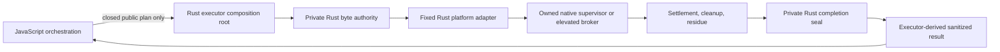

# Rust-owned native artifact consumption authority

- Status: accepted architecture for issues #110, #113, #114, and #115
- Date: 2026-07-14
- Source decision: issue #130 at integration base `090b29667a1e9d04f8e38b88d212b54717e87155`
- Prototype only: no package is installed, mounted, staged, launched, or accepted by this decision

## Decision

Move exact-byte consumption, platform execution, process supervision, cleanup, and completion derivation into one Rust-owned authority. JavaScript remains outside this boundary. It cannot import the authority, invoke a generic helper, provide a command or callback, observe a private path or handle, replace filesystem or process operations, or construct the sealed completion consumed by the executor.

The authority is a private Rust module in the production composition root, not a Tauri command, public library module, CLI mode, plugin, callback registry, environment protocol, or JavaScript native addon. Platform operations are statically selected from a closed Rust enum. The same Rust authority owns exact bytes from acquisition through complete process-tree settlement, cleanup, and residue classification.



JavaScript may eventually request a complete closed install-smoke operation through a narrow product-owned entry point, but it does not receive or drive the internal authority. The Rust executor validates the closed plan and performs the whole operation. There is no intermediate API that exposes acquisition, consumption, adapter dispatch, or completion validation.

## Why the JavaScript authority was rejected

The first prototype used module-private `WeakMap` state but called Node's shared `fs` object and live `child_process.spawn` binding. An ordinary caller could mutate those built-ins after module import, discover the temporary namespace, substitute the child launch through `syncBuiltinESMExports()`, and obtain a successful prototype result without the fixed child consuming the bytes.

Capturing JavaScript function references earlier only moves the timing assumption. It does not isolate shared filesystem visibility, loaders, native bindings, or completion code from other JavaScript running in the process. Issue #130 requires an ordinary-caller boundary, so the accepted design does not describe JavaScript closure privacy as the security mechanism.

## Current gap

`native-artifact-capability.mjs` owns and rehashes a private copy, then `native-install-smoke-executor.mjs` closes it after binding source descriptors. That source slice correctly prevents forged native proof, but it cannot pass live bytes to a platform operation. `nativeExecutionReceipts` is therefore intentionally unreachable.

The production follow-up must move the exact-byte acquisition and native operation into the Rust composition root. The current JavaScript capability remains a source-verification guard until that migration is independently reviewed; it must not grow a path getter, handle getter, spawn seam, callback, or completion validator.

## Threat boundary

### In scope

- ordinary same-process JavaScript after any repository module has loaded;
- JavaScript mutation of Node built-ins, `syncBuiltinESMExports()`, import order, module caches, and shared filesystem enumeration;
- callers passing extra flags, functions, commands, arguments, environments, paths, descriptors, handles, statuses, observations, receipts, or evidence;
- copied or reconstructed plans, capabilities, source descriptors, and completion-shaped data;
- capability or completion material from another operation;
- replay, concurrent consumption, close-before-use, and attempted close-during-settlement;
- replacement of the original public source after acquisition;
- replacement of a private path before or during a path-based platform operation;
- timeout, parent exit with descendants, partial execution, failed termination, cleanup failure, and residue;
- source, fixture, or prototype results being relabelled as native or public proof.

### Trust assumptions

- the reviewed Rust binary, Rust standard library, operating system, and fixed platform tools are trusted;
- the production build has not been replaced and the OS loader has not been compromised;
- arbitrary native-code execution inside the Rust process, memory corruption, debugger access, kernel compromise, or a hostile elevated administrator is outside this boundary;
- a separate process running as the same user is not isolated by a random filename or Unix mode bits alone. Real path-based adapters must use the platform controls below and treat a weaker fallback as unsupported.

This is an ordinary-caller boundary, not a claim that a compromised native process can sandbox itself.

## Authority contract

### Closed composition

1. The Rust executor creates the authority from a closed internal plan after public artifact selection and source verification.
2. The authority reopens or receives the verified source through native code, copies or streams the exact expected byte count, and verifies the digest before the public source can matter again.
3. Owned bytes, files, handles, paths, adapter state, process handles, job/process-group state, and cleanup state are private Rust fields. None implement serialization or cross the JavaScript boundary.
4. Dispatch is a private `match` over the five closed profiles. There is no registry, dynamic module, executable name, argument list, callback, or command runner supplied by a caller.
5. Consumption takes exclusive ownership of a one-shot lease. Safe Rust prevents concurrent mutation; replay and an early close fail before a platform operation starts.
6. The adapter returns a private observation. The authority combines it with settlement, cleanup, and residue state and creates a completion containing a private, per-operation Rust seal.
7. Only the exact executor instance that owns that seal can accept the completion. Completion-shaped JSON, a completion from another operation, or caller-authored status cannot satisfy the type and identity check.
8. The executor derives a sanitized result. A later independently reviewed implementation may mint `native_proven` only after every required native gate passes.

Rust ownership removes the replaceable JavaScript `fs` and `spawn` seams. It also removes the private path from the JavaScript heap and module graph. A platform adapter may still need a native path internally, but only the Rust supervisor or broker can see or use it.

### No authority surface

The production authority must not be reachable as any of the following:

- a Tauri `#[command]` that accepts acquisition, adapter, or completion inputs;
- a public Rust module or exported C ABI;
- an undocumented CLI flag or helper mode callable with arbitrary paths;
- an environment-variable, stdin, JSON, socket, or named-pipe protocol available to ordinary callers;
- a Node addon object, JavaScript callback, command runner, adapter factory, registry, or raw result validator.

Any broker protocol required for Windows elevation is the single exception and is constrained below: it is fixed, one-shot, authenticated to the Rust composition root, and returns only sanitized observations.

## Lifetime and failure model

```text
acquiring
  -> acquired
  -> consuming
  -> settling
  -> inspecting_residue
  -> cleaning
  -> closed

Any phase -> failed, while owned resources remain until settlement is known.
settling unresolved -> retained_unsettled
cleanup failed      -> retained_cleanup_failed
```

- Acquisition binds exact size and digest before issuing the one-shot lease.
- Original-source replacement after acquisition cannot change the owned bytes.
- A normal parent exit is incomplete while an owned descendant, mount, staging root, or Job Object member remains.
- Timeout terminates through the owned supervisor and is reported separately from the eventual process exit.
- Cleanup starts only after settlement. It attempts every safe owned resource and preserves consumption, timeout, settlement, residue, and cleanup failures together.
- Unresolved settlement or cleanup retains the resources required for recovery. It never deletes a path still used by an unsettled child.
- A failed completion may retain its private operation seal for matching and recovery, but it can never satisfy native-proof derivation.

| Boundary | Examples | Required result |
| --- | --- | --- |
| Acquisition | wrong bytes, link escape, source replacement, plan mismatch | `acquisition_failed`; no platform operation |
| Authority | forged plan, replay, caller command/callback/path/handle/completion | `authority_rejected`; no platform operation |
| Elevation | UAC denial or broker start/handshake failure | `elevation_denied` or `elevation_failed`; distinct and no installer start |
| Consumption | fixed tool cannot consume bytes, trust or identity drift | `consumption_failed`; settle anything started |
| Timeout | step deadline expires | `timeout`; terminate and settle without reclassifying it |
| Settlement | owned child or descendant remains unresolved | `retained_unsettled`; no cleanup or proof |
| Cleanup | unmount, close, delete, uninstall, or remove fails | `cleanup_failed`; preserve the primary outcome and no proof |
| Residue | process, mount, staged app, installed app, or forbidden state remains | `residue_failed`; no proof |
| Unsupported | host or transport cannot satisfy the closed contract | `unsupported`; no weaker fallback |

## Platform contracts

### Windows NSIS per-machine installer

BatCave ships NSIS with `installMode: perMachine`, so the installer requires elevation. An unelevated `CreateProcessW` call cannot produce a UAC prompt; it fails with `ERROR_ELEVATION_REQUIRED`. The accepted Windows design therefore uses a controlled elevation broker:

1. The unelevated Rust composition root launches one fixed, signed BatCave broker executable with `ShellExecuteExW` and the `runas` verb. It never calls `CreateProcessW` on the installer while unelevated.
2. User cancellation is reported as `elevation_denied`. Broker launch, signature, handshake, or policy failure is `elevation_failed`. Both occur before installer execution and remain distinct from `consumption_failed`.
3. The broker authenticates one one-shot closed request from the Rust composition root, reopens the selected public artifact, verifies exact size/digest, and creates the private elevated copy itself. The request cannot contain an executable, argument array, result, receipt, evidence, or private destination path.
4. The elevated broker is the byte authority and process supervisor. It holds the installer with Windows sharing that denies write/delete replacement, rechecks file identity, creates the fixed installer process suspended with `CreateProcessW`, assigns it to the owned Job Object, and only then resumes it.
5. The broker owns all installer/uninstaller process handles, Job settlement, timeout termination, cleanup, and residue checks. The unelevated parent cannot substitute process creation or declare settlement.
6. The broker returns only a bounded authenticated observation to the Rust executor. It never returns its private path, file/process/Job handles, command line, completion seal, native receipt, or evidence packet.

The Windows implementation must prove the broker authentication and ACL model, cancellation mapping, image identity, suspended assignment, descendant containment, uninstall, and residue behavior. This ADR does not provide that native proof.

### Linux deb and AppImage

- Prefer a Rust-owned inherited read-only descriptor exposed only to the fixed child as `/proc/self/fd/N`, while the Rust supervisor owns the process group and settlement.
- For AppImage, test `fexecve`, `execveat`, and descriptor-path behavior against a real image before choosing a transport.
- If a real tool requires a path, the Rust authority may create it privately and retain/recheck the open descriptor, but a same-user substitution gap is unsupported rather than silently accepted.
- `dpkg` lock behavior, maintainer-script descendants, AppImage runtime mounts, removal, and residue require native evidence in #115.

### macOS DMG and updater archive

- Test whether `hdiutil attach` accepts a Rust-owned `/dev/fd/N`. If it requires a path, keep the descriptor and path inside the Rust supervisor and prove identity plus private mount ownership.
- Implement updater-archive extraction in Rust against the authority-owned stream. Reject links, traversal, collisions, and budget overflow before staging.
- DMG attachment, contained-app trust, archive staging, launch, detach, removal, and residue require native evidence in #114.

## Non-installing prototype

[`native_artifact_consumption_authority_prototype.rs`](../../src/BatCave.App/src-tauri/tests/native_artifact_consumption_authority_prototype.rs) is a Rust integration-test crate only. It is not linked into the production library, registered as a Tauri command, exposed as a CLI mode, or callable from JavaScript.

The prototype:

- acquires exact verified bytes into Rust-owned memory, so it creates no discoverable private path or transferable handle;
- dispatches five closed profiles to one fixed internal worker with no caller command, callback, path, handle, environment, or status input;
- seals completion with a private per-authority Rust value and rejects a completion from another authority;
- exercises source replacement, mismatched/link sources, replay, early close, timeout-after-settlement, cleanup retention/retry, and sanitized non-proof output; and
- always reports package execution, installation/staging, `native_proven`, native receipt, and evidence as absent.

The fixed worker reads and hashes memory after a bounded delay. It does not create a native process, install, mount, extract, stage, launch, remove, or prove a public artifact. Its settlement model is a joined Rust worker, not proof of Job Objects, process groups, mounts, broker elevation, or package cleanup.

Run:

```sh
cargo test --manifest-path src/BatCave.App/src-tauri/Cargo.toml --test native_artifact_consumption_authority_prototype
node --test scripts/native-install-smoke-executor.test.mjs scripts/linux-native-install-smoke-adapter.test.mjs
```

The normal Windows, Linux, and macOS validation scripts already run the Rust test suite, so the prototype needs no release-workflow or Node-test hook.

## Rejected alternatives

### JavaScript closure, `WeakMap`, or captured built-ins

Rejected. Post-import built-in mutation and shared filesystem visibility can replace or observe the operations that matter. Treating this as an API-only contract would weaken issue #130's ordinary-caller requirement.

### Return a private path, descriptor, handle, or reader

Rejected. The caller could consume different bytes, disclose the resource, close ownership early, or pair one operation with another completion.

### Accept an adapter callback or dependency-injected command runner

Rejected. Caller code and caller-authored status would become the execution and proof boundary.

### Export a native helper CLI

Rejected. A helper accepting paths, commands, or completion-shaped JSON merely moves the injection surface across a process boundary. The Windows broker is allowed only because elevation requires it, and its protocol is fixed and authenticated to the Rust composition root.

### Unelevated `CreateProcessW` for a per-machine NSIS installer

Rejected. It cannot initiate UAC. Elevation must occur through the controlled `ShellExecuteExW(runas)` broker, and denial must remain a distinct result.

### One path-only transport on every platform

Rejected. It ignores Windows share-mode locking, Linux descriptor execution, in-process archive streaming, and the different behavior of `dpkg`, AppImage, and `hdiutil`.

### Treat a prototype hash as native proof

Rejected. A memory hash proves only that the fixed prototype worker saw the authority's bytes. It proves none of the native acceptance gates.

## Implementation sequence

1. Add a private Rust executor composition root while preserving the current JavaScript source-slice outcomes. Do not expose a Tauri command, generic helper, or native receipt.
2. Move exact-byte acquisition into that Rust root and reproduce #111's hostile source and cleanup contracts before deleting the JavaScript capability.
3. Implement Linux and macOS built-in adapters behind private Rust dispatch and prove their real descriptor/stream transports in #115 and #114.
4. Implement the fixed Windows elevation broker, request authentication, private elevated acquisition, suspended `CreateProcessW` launch, Job ownership, denial mapping, and cleanup in #113.
5. Make the private completion seal capable of deriving a native execution receipt only after each platform's ordered gates have independent native evidence.

Platform implementation can proceed in separate branches after this decision, but integration stays serial around the Rust composition root and completion derivation.

Delete the isolated prototype after equivalent production hostile tests are accepted. It is a decision probe, not a second executor.

## Residual risks and non-claims

- Rust ownership does not defend against arbitrary native code in the Rust process, memory corruption, a debugger, a compromised broker binary, kernel compromise, or a hostile elevated administrator.
- The prototype does not prove file locking, inherited descriptors, native process trees, UAC, mounts, extraction, package trust, launch, removal, or residue.
- The Windows broker protocol and private elevated storage require their own threat review and native tests.
- `dpkg`, AppImage, and `hdiutil` descriptor compatibility remain empirical gates. No implementation may silently fall back to an exported path.
- Exact public artifacts, signing, native install/runtime behavior, and #98 evidence remain owned by #42, #76, and #113–#115.
- No production executor, capability, adapter, receipt, or release-evidence behavior changes in issue #130.
