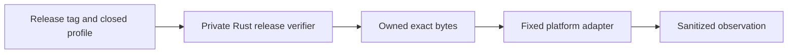

# Rust-owned native artifact consumption authority

- Status: accepted architecture with a production private verifier and platform-specific remaining work
- Date: 2026-07-14
- Source decision: issue #130 at integration base `090b29667a1e9d04f8e38b88d212b54717e87155`

## Decision

Exact-byte consumption, platform execution, process supervision, cleanup, and result derivation belong to one Rust-owned authority. JavaScript cannot import the authority, provide commands or callbacks, observe a private path or handle, replace filesystem or process operations, or construct a completion.

The authority is private to the `batcave-install-smoke` composition root. It is not a Tauri command, public library module, desktop CLI mode, plugin, callback registry, environment protocol, or JavaScript native addon. Platform operations are statically selected from a closed Rust enum.



## Why the JavaScript authority was rejected

Module-private JavaScript state still depends on shared Node filesystem and process bindings. Same-process code can mutate those built-ins, observe shared filesystem namespaces, or substitute launch behavior. Capturing function references only moves the timing assumption. The accepted ordinary-caller boundary therefore keeps the security-sensitive operation in Rust.

## Current implementation

The feature-gated `batcave-install-smoke` binary independently verifies the immutable public release, complete asset inventory, checksums, source-bound attestations, protected source identity, and selected bytes before private platform dispatch.

- The macOS updater profile owns and validates the compressed stream, stages only validated app entries, cleans the private root, and emits a bounded staging observation.
- The Linux profiles seal verified deb or AppImage bytes in a private immutable descriptor. The current production handler revalidates that descriptor and returns `skipped`; hosted package-transport tests exercise locally built payloads separately.
- Windows installer, macOS DMG, and complete Linux install/remove lifecycles remain open native-proof work.

No current profile mints a native execution receipt or release-evidence packet.

## Threat boundary

In scope:

- same-process JavaScript mutation, import order, module caches, and shared filesystem enumeration;
- caller-supplied commands, paths, handles, callbacks, statuses, observations, receipts, or evidence;
- copied or reconstructed selectors and cross-operation replay;
- replacement of a public source after acquisition;
- timeout, surviving descendants, cleanup failure, and residue; and
- fixture or source results being relabelled as public native proof.

Trusted are the reviewed Rust binary, Rust standard library, operating system, and fixed platform tools. Memory corruption, arbitrary native code inside the process, debugger access, kernel compromise, and a hostile elevated administrator are outside this boundary.

## Authority contract

1. Rust independently establishes release identity and selected bytes before dispatch.
2. Owned bytes, descriptors, paths, process handles, staging roots, and cleanup state remain private Rust fields and are not serialized.
3. Dispatch is a closed `match`; callers cannot provide an executable, arguments, environment, callback, or command runner.
4. Consumption is one-shot and operation-bound. Replay, early close, identity drift, or cross-operation substitution fails before proof derivation.
5. Settlement and cleanup retain every resource required for bounded recovery. Cleanup never discards primary failure information.
6. Only the composition root derives a sanitized observation. Native proof remains impossible until every platform gate passes.

The authority must not be exposed through a Tauri command, public Rust API, generic helper CLI, stdin or environment protocol, JavaScript callback, or raw result validator. A future Windows elevation broker is the only permitted process boundary: it must be fixed, one-shot, authenticated, and return only bounded observations.

## Platform constraints

### Windows NSIS per-machine installer

The fixed broker must launch through `ShellExecuteExW` with `runas`, distinguish UAC denial from launch failure, independently reverify the selected installer, assign the suspended installer to an owned Job Object before resume, supervise descendants, and return no path, handle, command line, receipt, or evidence.

### Linux deb and AppImage

Prefer a sealed, read-only inherited descriptor exposed only to a fixed child. If the required kernel, `/proc`, sealing, descriptor, process-group, or package behavior is unavailable, the profile is unsupported; there is no ordinary temporary-path fallback. Real installation, AppImage runtime behavior, removal, and residue remain issue #115 gates.

### macOS DMG and updater archive

Updater extraction stays in Rust against the authority-owned stream and rejects links, traversal, collisions, hidden members, and budget overflow. DMG attachment still lacks an exact-byte transport accepted by DiskImages; a same-user-visible path is not an authority substitute.

## Verification

```sh
cargo test --manifest-path src/BatCave.App/src-tauri/Cargo.toml \
  --bin batcave-install-smoke --features private-release-verifier
cargo test --manifest-path src/BatCave.App/src-tauri/Cargo.toml \
  --test linux_package_owned_transport
```

These suites cover release and asset binding, one-shot ownership, replay and drift rejection, sealed Linux descriptor properties, hostile macOS updater archives, settlement, cleanup retention, and sanitized non-proof observations. Hosted and source tests do not prove public native installation or release evidence.

## Rejected alternatives

- JavaScript closure, `WeakMap`, or captured built-ins.
- Caller-visible paths, descriptors, handles, readers, callbacks, or completion objects.
- Generic CLIs, Tauri commands, native addons, or dependency-injected command runners.
- Unelevated `CreateProcessW` for the per-machine installer.
- One path-only transport across all platforms.
- Treating a hash, fixture, staging observation, or locally built package probe as native proof.

## Residual risks and non-claims

The Windows broker, Linux native lifecycle, and macOS DMG transport still require platform-specific implementation and review. Exact public signing, installed runtime behavior, removal, settings preservation, and #98 evidence remain owned by #42, #76, and #113-#115.
