# Linux deb post-public smoke

Published releases get separate fresh, protected `ubuntu-22.04` deb and AppImage jobs after the release has been made public. This document covers the deb job. The fixed `scripts/linux-deb-post-public-smoke.mjs` and `scripts/linux-appimage-post-public-smoke.mjs` entrypoints share `scripts/linux-post-public-smoke.mjs`, but each selects one closed native capture and retains its own sanitized observation and output filename.

## Identity and byte boundary

The finalize job retains its exact pre-publication candidate JSON as a workflow artifact. The post-public job downloads that fixed artifact name and invokes `scripts/linux-deb-post-public-smoke.mjs` with the workflow-owned release tag, source SHA, and original release run ID. Its shared driver reads the candidate from one fixed repository-relative location. Neither entrypoint accepts a caller-selected profile, artifact path, command, environment, status, callback, or evidence payload.

Before installation, the job:

1. anonymously reads the public release API;
2. compares the release tag, source SHA, channel, immutable state, complete asset set, sizes, digests, and public URLs to the independent candidate inventory;
3. anonymously downloads every release asset;
4. verifies every downloaded digest and the complete `SHA256SUMS.txt` subject set; and
5. runs GitHub release and per-subject attestation verification against protected `main`, the exact source SHA, the pinned release workflow, and GitHub-hosted runners.

Only the unforgeable in-process verifier receipt can select the exact deb. The capture copies that file into a private root and rejects size or digest drift before package metadata inspection or privileged execution.

## Privileged operation boundary

Install and purge use a new random fixed-prefix transient service. The only root command path is:

```text
sudo -n systemd-run --wait --pipe --collect --service-type=exec ... /usr/bin/dpkg --install|--purge
```

The fixed service properties require `KillMode=control-group`, `SendSIGKILL=yes`, a ten-second stop timeout, a 120-second runtime maximum, 256 tasks at most, read-only control groups, and no delegation. Output and client runtime are bounded. HUP, INT, TERM, success, command failure, timeout, and output overflow all converge on a fixed `systemctl stop` plus repeated inactive-or-collected checks after the `systemd-run` client has settled.

Before package mutation, a fixed hostile service starts both an ordinary background sleeper and a `setsid` sleeper. The job requires the service to settle and both PIDs to disappear. Fixed systemd-owned `apt-get update` and `apt-get install` units then establish the exact Ubuntu runtime dependency set: `libgtk-3-0`, `libwebkit2gtk-4.1-0`, `libayatana-appindicator3-1`, `librsvg2-2`, and `libxdo3`. Successful prerequisite, install, and purge units all return process-local branded settlement receipts; reconstructed receipts are rejected. Prerequisites remain host setup and are not folded into BatCave package evidence.

## Native observations and cleanup

The installed package must own executable regular GUI and CLI files. The job records every existing non-directory path from the package-owned inventory, then runs:

- an exact source/version/install-kind packaged identity check;
- settings initialization and restart preservation;
- corrupt-settings degradation with visible persistence failure and preserved corrupt bytes; and
- a fixed two-tick strict packaged CLI benchmark that requires advancing core-runtime telemetry.

The public deb capture also launches `/usr/bin/batcave-monitor` with no arguments, using its production entry point. The fixed Python helper streams only the GUI regular-file member from the exact verified deb and requires the installed executable to have identical bytes. A separate transient unit runs the entire GUI observation as the invoking nonzero UID/GID. It inherits the same cgroup lifetime, output, task and settlement bounds as package operations; no root GUI or user-systemd manager is required.

The existing Ubuntu runner must provide regular executable files for `/usr/bin/python3.10`, `/usr/bin/Xvfb`, `/usr/bin/dbus-run-session`, `/usr/bin/import-im6.q16` and `/usr/bin/identify-im6.q16`, plus libX11 and the established app runtime libraries. The capture does not install additional tools. Missing tools fail the capture. It creates an owned Xvfb display with TCP disabled and a private MIT-MAGIC-COOKIE authority file, then a private D-Bus session. HOME, XDG directories and TMPDIR are isolated; caller credentials, fixture settings and the persistence-proof environment flag are not inherited. WebKit sandbox controls are unchanged. The [X.Org authorization contract](https://www.x.org/docs/man/man.pdf) permits the private FamilyWild record to authenticate the display selected by `-displayfd`; it does not disable authentication.

The observer requires a mapped `BatCave Monitor` window whose X11 PID matches the launched process. It checks the PID generation, current UID, exact owned unit cgroup, executable inode and executable digest before and after capturing that window. The PNG must match the window dimensions and contain at least 32 colors with normalized standard deviation of at least 0.02; a solid mapped frame does not pass. These mechanical checks establish a nonblank frame, not the correctness of every rendered control or live telemetry in the GUI. The private PNG must still be inspected independently.

```mermaid
flowchart LR
  Public[Verified public deb] --> Installed[Matching installed GUI bytes]
  Installed --> Unit[Standard-user owned cgroup]
  Unit --> Window[Authenticated Xvfb and D-Bus production window]
  Window --> Capture[PID and generation bound PNG]
  Capture --> Settled[GUI and package descendants settled]
  Settled --> Packet[Validated packet and fixed workflow artifacts]
  Packet --> Review[Independent render and qualification review pending]
```



Purge is unconditional after any install attempt. Inventory acquisition errors cannot skip it. Cleanup distinguishes a truly absent dpkg record from a failed query, treats dangling links as residue, requires the GUI, CLI, and observed package-owned files to be gone, preserves the documented current-user state root, and checks an outside sentinel.

The script writes and prints sanitized JSON only after public verification, native checks, package and GUI unit settlement, purge, residue checks, and workspace cleanup complete. The existing `linux_deb_post_public_observation` retains `release_evidence_eligible: false`; the current-user `native_candidate` packet is never relabeled or promoted. It also writes fixed private `post-public-output/linux-deb-gui.png` and `linux-deb-gui-observation.json` files with the byte/window identity and settlement receipt. The existing replay workflow retains these two files beside the sanitized observation and packet for 30 days. They may contain local process names or window pixels and are workflow evidence only, never public release assets; cookies, user-state files and environment contents are not retained. File permissions protect the local capture workspace; uploaded artifact access follows repository visibility and must not be treated as confidential storage.

## Public-release packet and remaining qualification

When the original release run ID is supplied, the driver also writes `post-public-output/linux-deb-release-evidence.json`. It rechecks the original publication job, source commit, run attempt, immutable release, and retained candidate through the existing origin verifier. Only matching in-process public-verification and native-capture receipts can produce this additional packet. It records the exact observed Ubuntu 22.04 x86_64/glibc 2.35 host, public package bytes, checksum-and-attestation trust, packaged CLI checks, and cleanup. The existing release-evidence validator runs before either output is written. Both fixed sanitized files are retained for 30 days.

For a successfully observed deb GUI, `runtime.launch` records the mapped current-user production window and nonblank frame. It keeps `private_display_render_review_pending` and `qualification_review_pending` blocked, preserves `deb_checksum_attestation_only`, and leaves every support-contract `native_oldest_supported` field pending. A CLI-only packet still keeps `runtime.launch` and `desktop_window_not_observed` blocked. Schema validation does not inspect the screenshot, complete attended desktop acceptance, qualify other hosts, or approve the release.

The shared AppImage lane writes `linux-appimage-release-evidence.json` with the same launch block. It records the verified updater-key identity and keeps extract-and-run, missing network isolation, and unexercised A-to-B updating explicit. `package_install` is `not_applicable`; extraction is not conventional installation.

The existing manual **Verify published release** workflow can replay the immutable public `v0.2.0` while its candidate artifact is retained, using source `2355d82b08a097259a67ccd789da032945768027` and original release run `36210769065`. No new publication or build of those package bytes is needed. The two-argument script invocation remains observation-only for existing callers. A packet requires the third original-run selector:

```sh
node scripts/linux-deb-post-public-smoke.mjs v0.2.0 2355d82b08a097259a67ccd789da032945768027 36210769065
node scripts/validate-release-evidence-packet.mjs post-public-output/linux-deb-release-evidence.json
```

These commands perform native install/purge and the owned production GUI observation on the dedicated Ubuntu host; they are not a local source-test command. Before using the resulting packet for qualification, confirm the observed runner OS/glibc, inspect the fixed PNG and receipt together, and review the remaining limitations. The AppImage lane, macOS and unsupported hosts gain no GUI or oldest-host proof from this deb-only capture.
