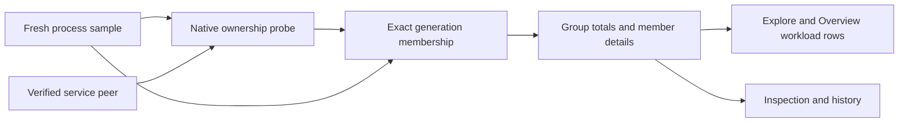

# Windows BatCave app grouping

The Windows desktop can present its verified components as one expandable **BatCave** workload. The desktop, collector service and owned WebView processes remain distinct process details inside that scope. A matching name or category never establishes app membership.

Installed behavior must be verified against an identified native candidate. Source tests and review alone do not establish that a package uses these rules.

## What can join

The native probe starts from the current desktop's exact process generation and image. An approved member must match one unambiguous process row from the newly accepted sample. Native process and image handles retain the evidence while creation time, liveness, canonical image, file identity, user and session are checked. Missing evidence leaves the component outside the special app scope.

| Component | Required relationship |
| --- | --- |
| Current desktop | Its own PID and nonzero creation time match the sample, with verified native image and token evidence. |
| Same-image desktop descendant | A complete verified parent chain reaches the desktop, user/session match, and canonical image plus native file identity match the desktop. |
| WebView helper | A complete verified parent chain through approved members reaches the desktop, user/session match, and the image is a versioned `Microsoft\EdgeWebView\Application\<version>\msedgewebview2.exe` under a Windows-known Program Files or current-user Local AppData root. The native image and file identity must remain stable during the probe. |
| Collector service | The active local transport has authenticated its SCM/pipe process, Local System principal, release and executable identity. The existing verifier requires `batcave-collector-service.exe` beside the current canonical `batcave-monitor.exe`. That exact verified service generation must occur once in the sample and pass the native probe. Its SCM parent and service session do not need to match the desktop's ancestry or session. |

Other applications' WebViews, another desktop copy, another user/session, arbitrary tools spawned by the desktop, unknown helper locations, ambiguous PIDs and missing creation times do not enter this scope. The existing executable/bundle-and-ancestry grouping still applies to other workloads, including macOS.

A portable or development desktop can group its own verified descendants. It cannot adopt an installed collector merely because the name matches or an installation registry entry exists. If the existing transport cannot authenticate the service as that desktop's sibling, standard-access collection continues without service membership authority. Grouping does not grant collection privileges or require a newly elevated desktop.

## Membership belongs to the observed sample

Approval is attached to fresh metric rows, then retained with those rows in the runtime. Helpers are probed once for each newly accepted service observation. An unchanged service reply can reuse that approval only when both source provenance and the verified peer remain identical. Renewal verifies the replacement transport before retaining the snapshot; a changed peer cannot lend authority to cached metrics.

On connection, authorization or service failure, the collector revokes approval for the next fresh sample. A successful fresh standard-access sample can approve the desktop and its helpers, but receives no service approval. If collection fails entirely, the runtime retains the previous historical scope with held quality markers until a new observation arrives. Held rows are not proof of current ownership.

Warm-cache rows receive no special native approval. PID reuse, an added or removed member, or changed verified membership produces a different exact group scope on a fresh sample. Ordinary value changes and row reordering preserve the key. Process inspection identity remains tied to PID and creation time; a previous group remains a historical scope rather than silently retargeting to a different set of components.



## Totals and inspection

Each included process contributes once. Group totals use the existing metric quality and coverage gates:

- CPU is the sum of one-core-equivalent process percentages; it can exceed 100% and is not machine-total CPU.
- Memory is the sum of observed member resident-memory values, not a reconciliation of physical RAM or a sum of private/virtual-memory values.
- Read/write I/O and attributed network are process rates, not physical-disk or interface totals. Missing or unavailable values do not become measured zeros or inflate the aggregate.
- Thread totals, metric availability and partial coverage describe the included members. Group counts and member IDs refer to the same unique process generations.

Filtering by an app label, member PID, executable or name selects the established scope. Sorting, focus and limits select workloads without shrinking a selected group's aggregate membership. A group header adds no OS process to the total count; its expanded children remain the separately inspectable component processes.

The backend supplies the same membership to Explore, Overview workload rows and the inspection archive. Displayed ranking values use the existing smoothing rules, while history retains instantaneous observations from accepted samples. Compare displayed totals with displayed member contributions, and historical totals with historical member observations. An unchanged reply appends no duplicate metric/history point.

## Overview contributor

For CPU, resident memory and network, the Overview hero selects the same leading workload from the unfiltered Overview rows. It uses the existing ranking, quality and coverage gates: grouped children and duplicate scopes do not compete with their aggregate, and held, unavailable or zero-coverage measurements cannot lead. Explore queries do not replace this scope.

A group hero shows its aggregate contribution, component count and reported coverage. Selecting it opens that exact opaque workload ID in the group inspector, where each component remains inspectable. A changed or removed scope is resolved from the current rows rather than retaining the previous group's identity.

The process contributor contract and process narrative facts remain process-scoped. A group hero does not borrow a representative process's explanation. Physical-disk throughput has no compatible process attribution; its hero says so even when the workload list can rank process read/write I/O. Process I/O does not become physical-disk contribution.

## Review and native verification

The bounded implementation is in `workload_identity.rs`, `windows_process.rs`, `collector_service/client.rs` and `runtime_store.rs`. It uses existing workload/group contracts. Focused checks include:

```powershell
cargo test --manifest-path src/BatCave.App/src-tauri/Cargo.toml --lib workload_identity::tests::
cargo test --manifest-path src/BatCave.App/src-tauri/Cargo.toml --lib collector_service::client::tests::
cargo test --manifest-path src/BatCave.App/src-tauri/Cargo.toml --lib windows_process::tests::
cargo test --manifest-path src/BatCave.App/src-tauri/Cargo.toml --lib runtime_store::tests::approved_batcave_totals_filters_and_member_details_share_one_scope -- --exact
cargo test --manifest-path src/BatCave.App/src-tauri/Cargo.toml --lib runtime_store::tests::batcave_context_latches_only_with_fresh_samples_and_keeps_existing_history_scope -- --exact
```

From `src/BatCave.App`, `npm run verify` checks the frontend contracts and build. `npm run test:accessibility -- --grep "Overview hero"` exercises aggregate selection, group inspection, partial coverage and the disk boundary in browser fixture mode. These interaction checks establish layout behavior only.

For an installed Windows candidate, record its release/executable identity, process generations, service peer evidence and grouping inputs. Capture native collapsed and expanded views, check member totals and inspectable identities, then exercise absent and restarted service behavior. A renamed development executable using standard fallback, source fixtures or browser layout screenshots cannot establish installed service membership.

See [runtime telemetry](runtime-telemetry.md) for quality/count semantics and [collector-service IPC](collector-service-ipc-v1.md) for the existing local trust boundary.
