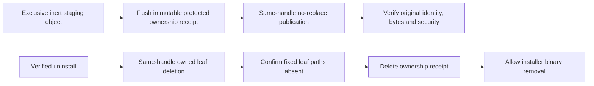

# Automatic Windows Start entries and ownership cleanup

Status: installer-owned CommonPrograms implementation for #216; exact-package native lifecycle qualification remains required. The owner approved a shared Start entry on 2026-09-27, reversing the earlier shared-entry retirement restriction. Windows support remains `10.0.16299` or later. This mechanism needs neither sparse MSIX identity nor a new signing prerequisite.

## Managed projection

The verified per-machine native provisioner owns one ordinary launch entry: `FOLDERID_CommonPrograms\BatCave.lnk`, displayed as **BatCave** in Start. It targets the verified fixed Program Files `BatCave Monitor\batcave-monitor.exe`, with no arguments, that directory as its working directory, the monitor icon, and AppUserModelID `dev.batcave.monitor`. It grants no elevated or service authority. Stock Tauri shortcut creation and deletion remain disabled. The historical `BatCave Monitor.lnk` retirement gate remains separate.

The GUI no longer creates raw per-user links. The shared projection covers current, logged-out and future users without profile enumeration, loading user hives, or interpreting over-the-shoulder elevation as a user-selection API. App Paths, service authentication and retained user data keep their existing contracts.

## Creation and recovery

The provisioner pins the OS-resolved CommonPrograms ancestry and the verified install directory without following reparse points. Directory pins request actual directory read access and deny delete sharing; every operation revalidates their file identity and handle-returned path. CommonPrograms keeps its ordinary Shell permissions, including user deletion where Windows grants it. Its ACL is never rewritten.

Creation uses exclusive native `NtCreateFile(FILE_CREATE)` on a fixed inert `BatCave-start-entry.tmp` relative to the pinned CommonPrograms directory handle. Fixed-component opens and creation use `OBJ_DONT_REPARSE` and non-directory/no-reparse options; there is no path-based fallback. A directory pin blocks reparenting but cannot by itself stop metadata-only in-place junction conversion. The native relative operation rejects that converted root before creating outside it. The leaf has an Administrators-owned protected DACL: SYSTEM and Administrators may write, ordinary users may read. The provisioner confirms its newly created identity before writing, then writes and flushes complete native ShellLink bytes while retaining the creation handle. It writes and flushes the protected immutable `start-entry.v1.json` relative to the pinned Program Files product directory handle. The receipt records the fixed target and root, volume/file identity, creation time, byte size, content digest, and owner/DACL digest. A readable description, nonce, name or matching target is never creation authority.

Only after recording does `NtSetInformationFile(FileRenameInformation)` publish the same object as `BatCave.lnk`, relative to the pinned CommonPrograms handle, with replacement disabled. Every destination ancestor remains pinned and revalidated. Staging and publication stay on the same volume, even when the install directory is elsewhere. Microsoft's [native file creation](https://learn.microsoft.com/en-us/windows/win32/api/winternl/nf-winternl-ntcreatefile), [object attributes](https://learn.microsoft.com/en-us/windows/win32/api/ntdef/ns-ntdef-_object_attributes) and [rename information](https://learn.microsoft.com/en-us/windows-hardware/drivers/ddi/ntifs/ns-ntifs-_file_rename_information) describe these native operations; qualification on the existing oldest Windows build remains required.

| Observed state | Action |
|---|---|
| No receipt and neither fixed leaf exists | Create a new exclusive projection; uninstall is already complete for this projection. |
| Valid receipt and exact original staging object | Resume publication on install/repair, or delete that original on uninstall. |
| Valid receipt and exact original final object | Reuse on repair/update; delete only that pinned original on uninstall. |
| Receipt present, both leaves absent | Confirm absence, retire the stale receipt; repair may then create a new projection. |
| No receipt but a staging object remains | Preserve/report ambiguous pre-record crash residue. It is inert, not a cleanup pass. |
| Missing/invalid receipt, both objects present, or changed identity/content/security | Preserve objects and report incomplete cleanup; never adopt or overwrite them. |

A live failure before receipt creation rolls back only the exclusive staging handle. Failed publication retains the recorded staging object and receipt for normal recovery. A partially written receipt after interruption fails closed; it does not authorize publication or deletion. No namespace scan is needed to report the fixed staging residue.

## Cleanup guarantee and ordinary user changes

Install and upgrade preflight ownership before service mutation; the final launch-registration gate is coupled to existing service rollback. Uninstall checks ownership before service mutation and removes the projection and receipt before NSIS may remove target binaries. Service-absent recovery uses the same cleanup. Errors abort native success, leaving target binaries available for recovery.

Cleanup guarantees removal of the **unchanged recorded current projection** for all users. The shared parent remains ordinarily mutable: users may delete, move or replace links and create their own copies or pins. A changed object at the managed path is preserved and reported incomplete. A moved object outside that fixed path becomes user-managed state; the installer does not search for or delete it. If both fixed leaf paths are absent, that projection is absent, without claiming that arbitrary user copies are gone. File IDs alone are insufficient: recovery also requires exact creation/content binding and an independently trusted owner and protected DACL.

Deletion uses the opened original file handle. The receipt remains until the owned leaf is gone and both fixed paths are observed absent. Cleanup then deletes the receipt and checks both Shell paths again at completion. A replacement observed by either absence check is preserved and prevents success; a late replacement can leave the already retired receipt absent. Later user changes are outside the completed transaction. This is ordinary Shell ownership, separate from the stricter service/installer executable trust boundary.

## Historical per-user links

The removed GUI creator left `FOLDERID_Programs\BatCave Monitor.lnk` without ownership receipts. New ownership cannot retroactively distinguish those app-created links from identical user-created links. The owner approved a bounded legacy inventory; deletion still needs a separate reviewed exact-path list. This implementation performs no profile crawl and no name/target-only legacy deletion. Incomplete legacy inventory remains explicit; #216 is not closed by source tests or by cleanup of new projections alone.

## Required native proof

Use exact approved NSIS artifacts on disposable Windows hosts. Prove Start enumeration and activation for standard users, over-the-shoulder administration, a logged-out user and a future user. Exercise fresh install, update, failed update rollback, repeat repair, interrupted staging/receipt/publication, foreign collisions, user changes, and uninstall through Apps & Features, administrator and SYSTEM paths. Observe fixed projection/receipt absence before binary deletion and retained user data afterward. Preserve legacy inventory separately.

Qualify build 16299 and current Windows independently; hosted tests do not establish Start/Search refresh or installed activation. The original historical rc.2 producer is not recovered. #240 now qualifies the approved supported public-package lifecycle, with its strict service/root/rollback regression guards retained. Native environment actions and legacy deletion retain their separate approval gates.
