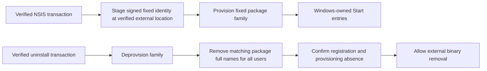

# Automatic Windows Start entries and all-user cleanup

Status: proposed ownership design for #216, not implemented or qualified. On 2026-09-26 the owner required automatic Start entries and guaranteed cleanup for every user. Manual cleanup and removing automatic discoverability do not satisfy that requirement.

## Current gap

`windows_user_launch.rs` creates a missing raw shortcut during an eligible unelevated installed launch. It preserves existing objects and records no creation receipt. Machine uninstall leaves those shortcuts behind. [ADR 0013](decisions/0013-windows-shared-shortcut-retirement.md) describes this current behavior, which does not meet the new requirement.

Keep installer-owned App Paths and the LocalSystem collector lifecycle. Preserve shared-shortcut retirement, retained user data, standard-access fallback, and rejection of foreign objects. Do not enumerate profiles, load arbitrary user hives, infer the initiating user from elevation, or delete links based only on their name or target.

## Candidate: Windows-owned package projection

First qualify a signed sparse MSIX identity package with an external location beside the existing NSIS installation. Windows would own Start entries through its deployment database, while NSIS would still own the executable directory and service. Microsoft documents [external-location identity packages](https://learn.microsoft.com/en-us/windows/apps/desktop/modernize/grant-identity-to-nonpackaged-apps); this requires trusted package signing and Windows build 19041 or later. It is a feasibility candidate, not a promise that current BatCave packaging already supports it.

Use visible manifest visual elements: the identity-only sample's `AppListEntry="none"` deliberately hides the app. User pinning remains separate from automatic All Apps discoverability.

Compatibility gate: BatCave's current Windows contract remains `10.0.16299` or later. External-location package identity requires build `19041`; skipping registration on builds 16299-19040 does not satisfy automatic Start discovery and guaranteed all-user cleanup there. Before implementation, qualify another ownership mechanism for that supported range or obtain explicit approval to change the support contract and release/upgrade qualification matrix. This proposal does not raise the Windows floor.

Use the OS package database to enumerate only the fixed family across users. Deprovision by **family name**, then remove each verified matching **full name** with `RemoveForAllUsers`; do not copy current-user-only enumeration from a sample. The API references define [provisioning](https://learn.microsoft.com/en-us/uwp/api/windows.management.deployment.packagemanager.provisionpackageforallusersasync), [deprovisioning](https://learn.microsoft.com/en-us/uwp/api/windows.management.deployment.packagemanager.deprovisionpackageforallusersasync), and [all-user removal](https://learn.microsoft.com/en-us/uwp/api/windows.management.deployment.removaloptions).

## Work and acceptance order

| Work | Acceptance evidence |
|---|---|
| Bind publisher, name, family, version and external location | Exact signed package and manifest identity; reject colliding/foreign registrations without adopting them. Choose credentials before production signing changes. |
| Scope desktop identity | Apply identity only to the monitor. `build.rs` currently embeds the release manifest through global linker arguments; service, proof and test binaries must not inherit GUI identity. |
| Transfer Start-entry ownership | Disable the `windows_user_launch` raw-link creation path when package projection becomes the owner. Repeated launch, repair and concurrent stale processes must not create fresh raw links outside package cleanup; prove this during the transition. |
| Integrate install, update and repair | Observe deployment results and read them back. Define retry, concurrent registration and user-removed-package repair behavior. Candidate failure restores the prior registration and service generation. |
| Integrate uninstall | Remove all-user registration/provisioning before deleting external binaries. Failure keeps launch targets intact and reports incomplete cleanup; recovery must also handle later service-removal failure. |
| Qualify native activation and data | Start launches the exact installed monitor with current WebView/native resources. Settings/cache remain governed by the existing retention policy. |
| Resolve historical shortcuts | Establish an explicit migration contract before claiming cleanup of existing raw links; the new package cannot retroactively own them. |

## Historical-link blocker

Existing raw links have no trustworthy creation receipt. A new receipt cannot establish who created an old object, and a package's all-user removal cannot delete unrelated raw links. Guaranteed cleanup of historical app-created links therefore remains unresolved under the current no-profile-crawl/no-unowned-deletion constraints. Do not silently narrow #216 to new installations or report platform registration as the completed migration.

## Disposable Windows proof

Use genuine standard users A/B, an existing logged-out user C, a newly created user, and an over-the-shoulder administrator. Prove automatic Start discovery and activation, repeat launch, repair, upgrade, rejected signatures/identities/locations, interrupted deployment, and rollback. Then exercise uninstall separately through Apps & Features, admin and SYSTEM paths. Verify all-user registration and provisioning absence, no broken package-owned Start entry after another login, no new-user reprojection, and retained user data. Preserve user-created collisions and record legacy links separately.

Qualify the oldest supported Windows build and the first sparse-capable build, 19041, separately. This needs disposable Windows hosts and exact approved signed artifacts. Hosted compilation cannot replace these observations. #240's historical rc.2 upgrade proof is a separate gate: its existing controller finishes with uninstall and must not be run against an unrelated installed baseline. Coordinate the two evidence packets only after their exact package identities and starting states agree.

The current unsigned-release path remains unchanged. This proposal creates a signing prerequisite for the proposed #216 implementation; it does not authorize credentials, paid resources, public releases, or installed lifecycle actions, and it does not close #42, #216, #240 or #76.
